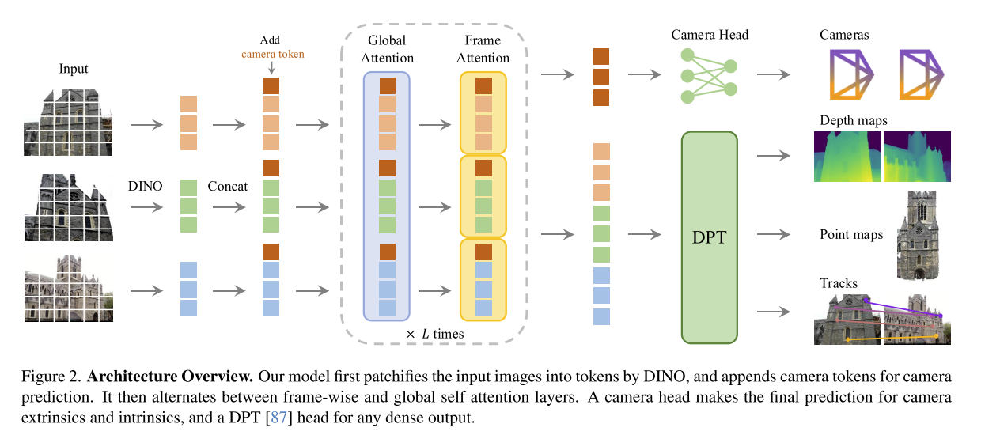

# VGGT: Visual Geometry Grounded Transformer

CVPR 2025 Best Candidate

Task: 从单帧或多帧（可以上百帧）的图片直接估计
- camera parameters
- point maps
- depth maps
- 3D point tracks

可以用理解为一个很强大的 structure from motion 模型，且只需要任意数量图像输入。其核心方案是一个足够强大的 ViT Based Backbone，足够多的 multi task 数据来训练。最终得到的结果可以做到在几十到几百毫秒内完成所有任务。

技术路线上说，可以理解为顺着 DPT (Vision Transformers for Dense Prediction) 的方案，在 3D Geometry 领域证明了 ViT Based 架构的 scale up 能力。

本文有一些很值得注意的设计
- 模型结构的通用性，没有用专门的 3D 信息处理的模型结构。
- 充分使用现有 backbone
- 冗余计算，3D Annotation 之间是有映射关系的，比如在已知 camera intrinsics and extrinsics 和 depth map 的情况下就可以计算每个 image 的 point map，但是本文同时输出这些 annotation
    > However, as we show in Sec. 4.5, tasking VGGT with explicitly predicting all aforementioned quantities during training brings substantial performance gains, even when these are related by closed-form relationships. 
- permutation equivariant，模型可以输入任意帧数，且对帧的顺序没有要求，只是会将第一帧作为 reference frame。
- Self-attention Only。不同帧之间没有用 cross attention 来关联，而是交替使用帧内和跨帧的 self-attention。（是否有 frame pos emb?）

## Problem Definition

输入属于同一个 scene 的 N 帧 RGB 图像，对每一帧都输出一系列不同的 3D Annotation

$$
f((I_i)_{i=1}^N) = (g_i, D_i, P_i, T_i)_{i=1}^N
$$

- $g_i\in\mathbb{R}^9$ , camera intrinsics and extrinsics , $[\mathbf{q, t, f}]$ , $q\in \mathbb{R}^4$ 是 4d quaternion， $t\in \mathbb{R}^3$ , translation。 $f\in\mathbb{R}^2$ field of view。可以看出相机参数是简化的，即无形变，相机中心即为画幅中心。这样的简化和 SfM framework 是一致的。
- $D_i \in \mathbb{R}^{H\times W}$ , depth map
- $P_i \in \mathbb{R}^{3\times H\times W}$ , Point map，和 depth map 不同，直接输出 3D 坐标。当输入多帧图片是，其参考系为第一帧图像的相机参考系。
- $T_i \in \mathbb{R}^{C\times H\times W}$ , C-dimensional features for point tracking, 实际的 tracking 由另一个模块输出。

## Model Architecture

### Feature Backbone

非常直接的 Backbone 设计，就是一堆 self-attention only ViT Blocks，外加一点点小设计
- 输入是 DINO patchified image tokens
    - 每一帧 $I$ 都得到 $K$ 个 token $t^I_i\in \mathbb{R}^{K\times C}$，总共得到 $t^I=\cup_{i=1}^N\{t^I_i\}$
- self attention 会分别在两个维度进行
    - 同一个 frame 内的 tokens 之间算 self-attention $t^I_i\in \mathbb{R}^{K\times C}$
    - 所有 tokens 之间算 self-attention $t^I=\cup_{i=1}^N\{t^I_i\}$ 

没有 cross-attention。

部分输出使用 trainable token ，这里参考了最早 BERT 中的 CLS token，以及 [2024 ICLR Vision transformers need registers](../Transformer/[2024%20ICLR]%20Vision%20transformers%20need%20registers.md)。具体来说

- 使用 DINOv2 得到 image tokens $t^I=\cup_{i=1}^N\{t^I_i\}$
- 每一帧都加上一个 camera token $t_i^g \in \mathbb{R}^{1\times C'}$ ，和四个 register token $t_i^R\in \mathbb{R}^{4\times C'}$ 。这四个 register token 和 [2024 ICLR Vision transformers need registers](../Transformer/[2024%20ICLR]%20Vision%20transformers%20need%20registers.md) 中的一样，充当寄存器的作用。
- 把所有 (16*16 + 5) * N 个 token $(t_i^I, t_i^g, t_i^R)_{i=1}^N$ 过前面提到的 feature backbone (文中称为 Alternating-Attention 交替注意力)，得到输出 $(\hat{t}_i^I, \hat{t}_i^g, \hat{t}_i^R)_{i=1}^N$
- camera token 和 register token 都是 learnable token。但是文章将其分成了两组，一组给第一帧用，一组给其他帧用，以此来区分第一帧以作为 reference frame。（所谓的分组也就是用两组 model parameter）
- 寄存器 token 会被丢掉（这也是为啥被称作寄存器），camera token 会用作后续输出。

### Prediction Heads

本文最终输出的四个内容，camera, depth, point, track 都从 $(\hat{t}_i^I, \hat{t}_i^g, \hat{t}_i^R)_{i=1}^N$ 中得到。

#### camera

$g_i\in\mathbb{R}^9$ , camera intrinsics and extrinsics , $[\mathbf{q, t, f}]$ , $q\in \mathbb{R}^4$ 4d quaternion， $t\in \mathbb{R}^3$  translation , $f\in\mathbb{R}^2$ field of view。

将 $(\hat{t}_i^g)_{i=1}^N$ 过四个额外的 self-attention layer，然后用一个 linear layer 输出结果。似乎没有对数值进行其他 normalization。

#### depth & point map

这两部分都是 dense prediction，本文使用 [DPT](../Transformer/[2021%20ICCV]%20Vision%20Transformers%20for%20Dense%20Prediction.md) 中的结构。

具体来说：

- 在本文实现的 Feature Backbone 中一共有 24 层交替的 Alternating-Attention， dense head 的输入是其中选取的四层的输出 `intermediate_layer_idx: List[int] = [4, 11, 17, 23]`
- 将每一层的输出都重新 unpatchfy 成 2d，然后用卷积层进行上采样
- 将上采样得到的4层输出融合成一个 feature map，
    - 先将其通过 1x1 卷积到统一特征维度
    - 通过几个卷积层做上采样，看上去是4倍上采样
    - 按照 Layer 4 (最深层) → Layer 3 → Layer 2 → Layer 1 (最浅层) 的顺序将其融合，方式就是三次带残差的卷积，并且在每一次之后都做一次线性插值上采样到下一层的分辨率。
- 最后用卷积做输出，其中最后一层卷积是 1x1 卷积，即线性层。

在 DPT 的使用上，本文也做了额外的设计，具体来说，

- 原则上每个 frame 的 tokens 都需要独立 unpatchfy 然后输入 DPT，这相当于输入 `(B, N, 1024, H', W')`，其中 `H'=W'=518/14=37`，`N` 为不确定的图片数量。
- 在 N 很大的时候，直接这样输入会占用大量显存，为了平衡显存使用和计算速度，VGGT 使用 chunk_size=8，即每次最多处理 8 张图片。在显存比较富裕的时候当然可以修改该参数以加速训练。多次输入和一次性输入，在 torch 的计算图得到的梯度是等价的，但是同时存在的中间变量会变少，以减少显存使用。

## Discussions

本文的一些探讨很有意思

1. DINOv2 的作用

用不用 backbone，只要数据到位训练到位，都是可以 work 的。

但是使用 backbone 使得训练过程更加稳定，且对于训练的超参数更加不敏感。

2. 代码质量

目前看来 VGGT 的代码质量非常非常高，可复用度也很高。
