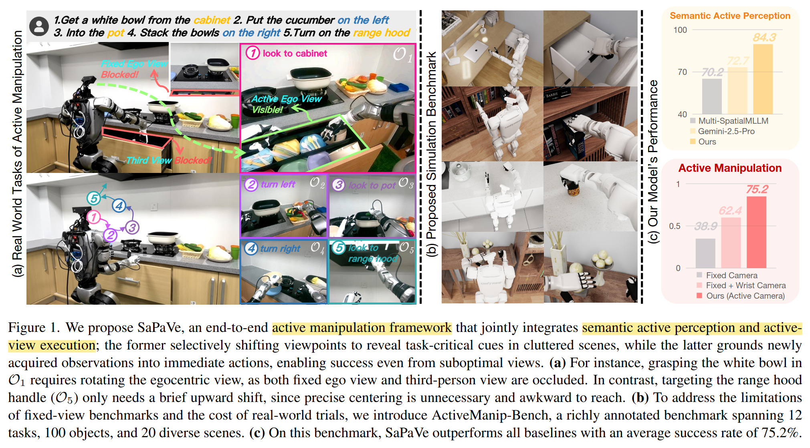
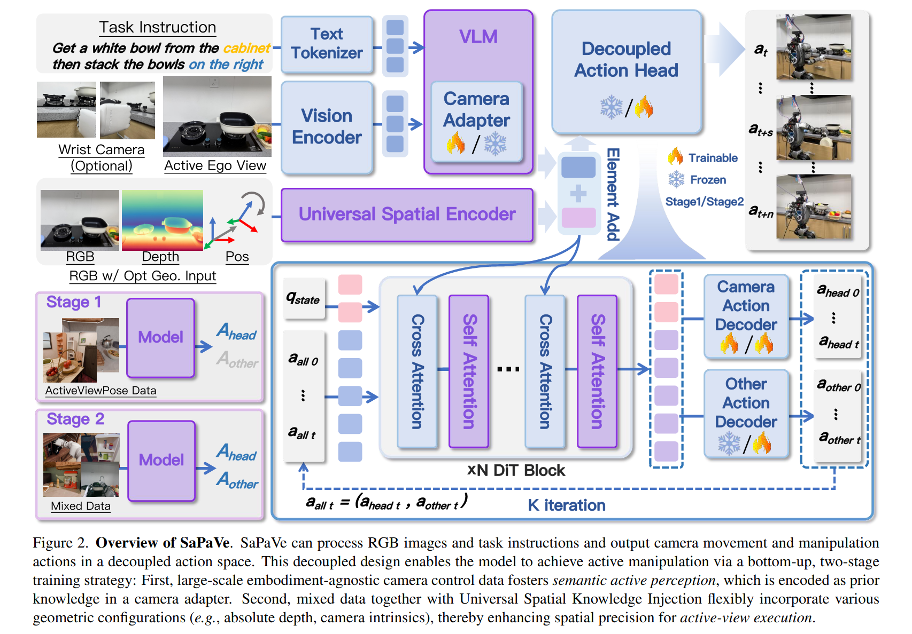

# SaPaVe: Towards Active Perception and Manipulation in Vision-Language-Action Models for Robotics

[page](https://lmzpai.github.io/SaPaVe/)

Mengzhen Liu, Shanghang Zhang

State Key Laboratory of Multimedia Information Processing, School of Computer Science, Peking University

Active perception & manipulation

- 整体是 VLM 范式的
- 关心的问题除了相机的动作，还包含能在目标姿态下完成任务
- 在方法的同时也提出了 Benchmark

## Task Specification

文章对 Active Perception 问题的定义还是明确的

- Given obeservation $\mathcal{O}_t\in \mathcal{O}$
- Given language instruction $L\in\mathcal{L}$
- learning a polity $\pi_\theta: \mathcal{O}\times\mathcal{L} \rightarrow \mathcal{A}$ to predict a trajectory $A_t = \{A_{head,t}, A_{other,t}\} \in \mathcal{A}$

但是在输入输出上有特别要求和设计

- Observation 是单张当前的 RGB 图像、深度图像、相机参数，即直接使用其他模块提供的显式的 geometry info 来提供几何信息。
- Action 是一段轨迹。实际上是标准的 $\pi_*$ 类 VLA 模型的 action expert 范式。
- $A_{head,t} = \{a_{head}^\tau\}_{\tau=t}^{t+k-1}$，$\{a_{head}^\tau\}\in \mathbb{R}^2$ 仅包含机器人头部（摄像头）的 relative pitch, yaw
- $A_{other,t} = \{a_{other}^\tau\}_{\tau=t}^{t+k-1}$，$\{a_{other}^\tau\}\in \mathbb{R}^{26}$ 是实验所使用的人形机器人的其他关节。

文章没有用 $A_t = \{A_{head,t}, A_{other,t}\}$ 来一同解决 perception 和 manipulation，而是将原本的问题拆分成两个子问题，分别由两个 action space 解决，在模型架构上也将两个 action space 由不同 head 分开

- semantic active perception: 即输入指令，机器人针对指令和当前观测，转动头部获取更合适的 perception 的过程
- robust active-view execution: 基于这样正在变动的 observation 来执行实际的 manipulation 动作。

机器人动作的执行当然可以是在 perception 之后，但本文并没有做这样的限制和假设。通俗的从架构上来看，相当于一个 VLM 和两个 action expert，perception expert 模仿数据中头部动作，manipulation expert 模仿剩余动作。

## Architecture

这个架构图好看是好看，但是信息过于模糊了，总结起来大概是

- 总体上是一个 VLM + Action Head 的架构
- Action Head 是一个 DiT (Diffusion Transformer)，应该就是某个 $\pi_*$ 的 codebase
- VLM 里面的 Camera Adapter 实际上就是 LoRA，即用 LoRA 对 VLM 部分进行了微调。
- 几何信息没有输入 VLM，而是直接通过 cross attention 作为 condition 输入了 action head 的 DiT

训练过程分成了两个阶段

- Semantic Active Perception Alignment. 即训练 $A_{head}$，数据是 200K 条 (image, language, movement)
- Active Manipulation Fine-tuning. 同时训练两个 head，上面的 200K 条再加其他的

## Data

ActiveViewPose-200K Dataset.

- 使用 Objaverse 中的模型文件
- 使用 [infinigen](https://github.com/princeton-vl/infinigen) 生成 500 个场景
- 用 heuristic algorithm 来生成 image-to-camera movement 的数据
- 设计 3000 个用于生成指令的 task templates
- 用 GPT-4o 基于 task template 生成最终的指令标注

ActiveManip-Bench.

- 环境为 Isaac Sim + G1 humanoid robot
- Benchmark 包含 100 个物品，20个场景，12 种任务。