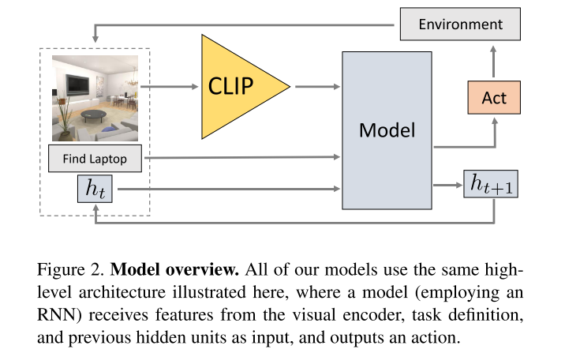

# Simple but effective: Clip embeddings for embodied ai
Cite 171. EmbCLIP paper. [Code](https://github.com/allenai/embodied-clip)
作为 CLIP Model 在 Object Navigation 任务中的一个直接应用，几乎没有多少算法设计，本身定位是一个 baseline algorithm. 但是本文的效果已经比以往的 ObjNav 的方法要好了。

Task: zero-shot Object Goal Navigation.

这里的 zero-shot 指的是可以直接用 language 的形式给出目标，并且这个目标以及对应的文本不会在训练数据中出现。

## Method

- 使用 CLIP ResNet-50 visual encoder. 不做 fine-tuning.
- 将 CLIP Encoder 得到的 representation 和 goal specification 拼起来，输入一个 RNN Model.
- RNN Model 用一个 linear output head 输出离散的 action 
