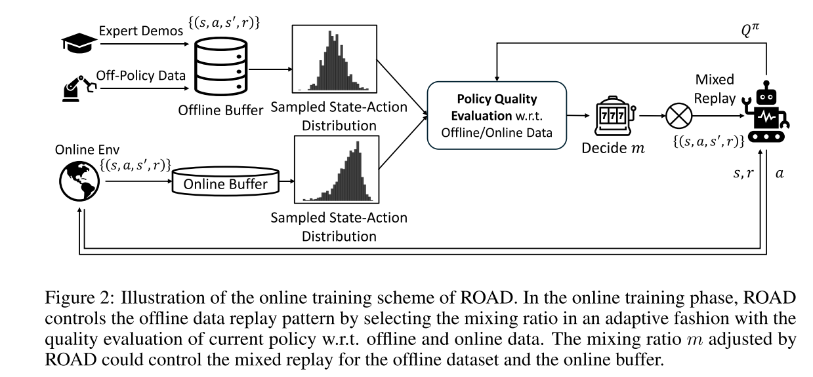
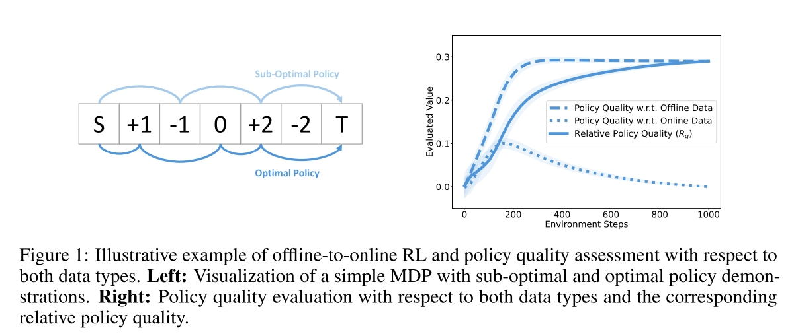
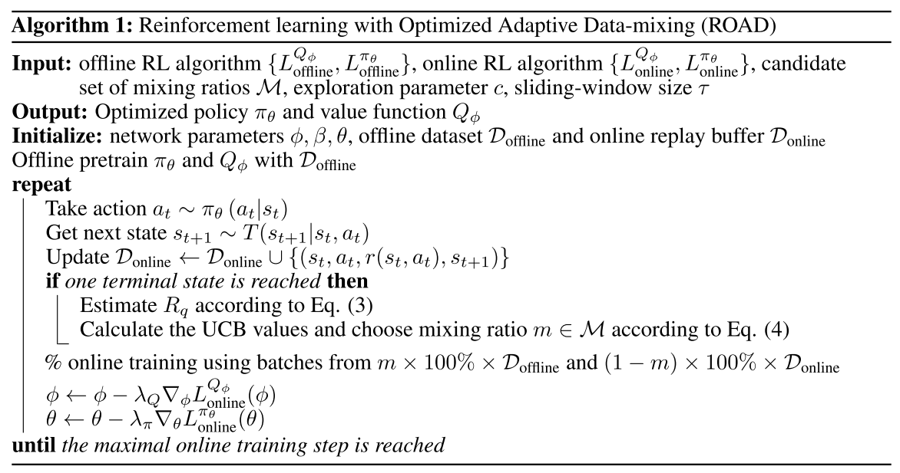

# Adaptive Offline Data Replay in Offline-to-Online Reinforcement Learning
(Under Review)

Task: combining rich offline experiences with active online explorations for RL.

本文要解决的实际问题就是同时使用 Offline 和 Online 数据训练 RL 的时候，应该怎么控制两种数据的使用。而基本想法是通过当前 Policy 在 Offline 和 Online 数据上的表现，来衡量两类数据之间的 distribution shift.

总体流程如下

## Measurement of Policy Quality Against Offline and Online Data
为了衡量正在训练中的 Policy 在 Offline 和 Online 数据上的表现，本文的方式是计算 $a\in \pi_\theta$ 和 $a\in \mathcal{D}_{\text{online/offline}}$ 所得到的 Q value 的差值，online policy 能得到的 Q 差值越大，说明当前的 Online Policy 相对于 dataset 中的 policy 提升越大
$$\mathbb{E}_{s\sim \mathcal{D}_{\text{offline}}, a\sim\pi_\theta}[Q_\phi(s,a)] - \mathbb{E}_{s\sim \mathcal{D}_{\text{offline}}, a\sim\mathcal{D}_{\text{offline}}\theta}[Q_\phi(s,a)]$$
$$\mathbb{E}_{s\sim \mathcal{D}_{\text{online}}, a\sim\pi_\theta}[Q_\phi(s,a)] - \mathbb{E}_{s\sim \mathcal{D}_{\text{online}}, a\sim\mathcal{D}_{\text{online}}\theta}[Q_\phi(s,a)]$$

理论上来说，对于使用 offline data pretrain 然后进行 online training 的训练流程来说，第一个 metric 应当呈上升趋势，第二个 metric 则先上升后下降，如下图所示。

## Reinforcement learning with Optimized Adaptive Data-mixing (ROAD)
定义 Relative Quality $R_q$ 为前文提到的两种 Policy Quclity 的差值（offline - online），而 ROAD 的目的就是最大化 $R_q$。

随着 online training 的进行，$R_q$ 是会上升的。$R_q$ 越大，意味着
- Policy Quality w.r.t. Offline Data 越大，即相对于 Offline Data 来说，Policy 采取的 Action 能得到更高的 Q Value，这说明 Offline Data 的价值相对于当前的 Policy 已经没那么高了。
- Policy Quality w.r.t. Online Data 越小，即相对于 Online Data 来说，Policy 采取的 Action 只能获得更低的 Q Value，说明 Online Data 有更高的参考价值。

所以本文的思路就是 $R_q$ 越大，Online Data 在 Mix Data 中占比越大，Offline Data Ratio $m$ 越小。

据此，本文采用的自动调节 Offline Data Ratio $m$ 的方法是
$$m_t = \argmax_{m'}\left\{ \bar{R}_{q,m'} + \sqrt{\frac{c\log(t\wedge\tau)}{N_t(\tau, m')}}\right\}$$
- argmax 里第一项是最大化 Relative Quality，第二项则是为了 exploration of m。
- m 的取值范围是离散的
- t 是 online training 到现在的总 step 数量，$t\wedge \tau$ 是 $\min(t, \tau)$
- $N_t(\tau,m')$ 是整个 $t$ 过程中 $m'$ 出现过的次数（step 数），即这个 $m'$ 被选中过的次数越少，越容易作为接下来的 $m$。
- $c$ exploration parameter
- $\tau$ 最大可以选择和 $t$ 一样大，即根据过往所有 history 调节接下来的 $m$，$\tau$ 越小，则越适应快速变化的 distribution。

最终算法的总体流程如下

## Question
- 文章的想法太想当然和经验主义了，基本就是直觉上是这样所以这样做。
- Value Based RL 算法中，Q function 和 Policy 是交替更新的，换句话说当衡量 Policy Quality 的时候，使用的已经是更贴合 Online Data 的 Q function 了，这产生的影响文中没有讨论。
- 算法的表现和任务复杂度之间有无直接关联？

- The ideas in the paper are too presumptive and empirical, essentially relying on intuition.
- In Value Based RL algorithms, the Q function and Policy are updated alternately. In other words, when evaluating the Policy Quality, the Q function used is already more aligned with the online data. Will this effect the computation of Policy Quality?
- Is there a direct relationship between the algorithm's performance and the task complexity?