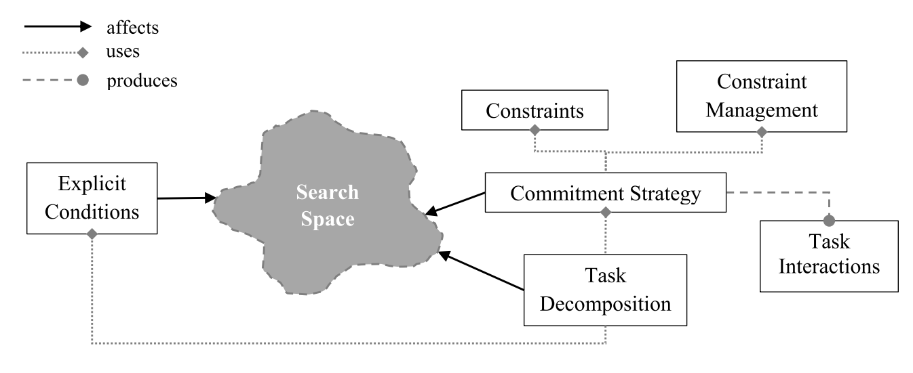

# HTN planning: Overview, comparison, and beyond
对 Hierarchical Task Network 的一个 survey。

HTN 本质上还是 Task Network，依赖于详细定义的 method 才能够正常工作。

> HTN planning appears to be controversial as well. The controversy lies in its requirement for well0conceived and well-structured domain knowledge.

HTN 的优越性并不来自于其易用性，而是来自于其本身的强大表达能力。例如表达递归关系，就可以用 method 调用 method 的方式来表达。而这样的表达能力是传统的只有 action 的方法所不具备的。但同样，如果不去利用递归定义一类的功能，HTN 并不能表现出什么相较于 State Space Search 或者 Plan Space Search 的优越性。

和 Search 方法不同，HTN 的求解过程是基于 decomposing 的，将所有 task 分解到 primitive 级别之后，也就完成了求解过程。然而，分解方法完全依赖于 method 定义，这就使得 HTN 无法完成没有定义过的 method。

以泡咖啡为例
- State Space Search 对这个问题的定义是，将咖啡豆，冷水，杯子组成的系统状态，变成杯子里面装着热咖啡的状态。这样在求解时，就需要首先去判断对一个杯子可以采取哪些 action，例如我可以拿起杯子，可以往杯子里倒水。然后在经过一顿检索之后，得出了一个 applicable action 的序列。（或者反向找到一系列 relevant action 序列）
- Plan Space Search 对问题的定义类似，但是会将这个问题本身视作一个不完整的 Plan。在求解过程中，会逐渐解决 plan 中不完善的部分，会经历类似如下过程
  - 当前目标中，我们还没有热咖啡
  - 找输出热咖啡的 action，`过滤（机器人，咖啡粉，杯子）` 可以得到热咖啡，所以把 `过滤` 加入 Plan
  - 新加入的 Action 中，`咖啡粉` 还没有，找输出咖啡粉的 action 所以把 `研磨（咖啡豆）` 放在 `过滤之前`
  - ...
- HTN 对问题的定义则完全不同，要想完成一个泡咖啡的任务，必须定义一个名叫 `泡咖啡` 的 method，并且定义该 method 分为 `磨咖啡，冲泡` 等步骤，然后还需要进一步定义 `冲泡` 分为 `热水，倾倒，搅拌` 几步。

基于分解而不是基于搜索，就决定了 HTN 并不是一个很自动化的系统，而更像是一个可编程的行为系统。

## 基本概念

### Task Decomposition
通过 method 将 task 分解为 task network 的过程，主要有以下几种
- Totally Ordered Task Decomposition (TOTD): 也就是所有 method 的 task network 都是 totally order 的，也就不需要关注 order constraint
- Unordered Task Decomposition (UTD)： Task 之间不存在 Order，会遍历所有可能顺序，感觉不会有实际应用吧
- Partially Ordered Task Decomposition (POTD)： 和 PSP 类似的方式处理 Order，允许暂时的 Parallel，将 Order 作为 Constraint 处理。

### Constraints
- Commitment Strategy: HTN 有两大类决定如何解决 Binding 和 Ordering Constraints 的策略，一种是 least-commitment strategy，也就是能拖多久拖多久，另一种是 early-commitment strategy，也就是在求解过程中 Variable Binding 和 Order 始终是确定的。
- Task Interaction: 有点类似 Causal 的一个概念，同样也会有 harmful interaction，也就是 threats 和 flaws，文中对 harmful interaction 进行了一个简单地分类
  - Deleted-condition interaction: 一个 task 的 effect 删掉了另一个 task 的 precondition
  - Double-cross interaction: 两个相邻的 task 互相删除彼此的 precondition
  - 