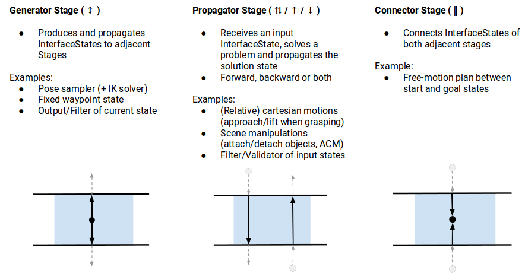

# Moveit! Task Constructor for Task-Level Motion Planning
这篇文章的目的简单说就是 “让 MoveIt 能够执行 Task Plan 的结果”。

对于 Task Plan 任务而言，Plan 过程中不能牵扯到 continuous value 的求解，所以任务中所有参数都是离散化的 symbolic reference。这篇文章就是为了填补 Task Plan 的结果和实际执行之间的空缺。

- [github](https://github.com/ros-planning/moveit_task_constructor)
- [tutorial](http://moveit2_tutorials.picknik.ai/doc/moveit_task_constructor/moveit_task_constructor_tutorial.html)

**Note:** 虽然给出了 ROS2 Tutorial 的链接，但是实际上该库尚不支持 ROS2。

## 基本概念
- Task：即 Task Plan
- Stages：Task Plan Solution 中的每一个子问题。这里把 Stages 分为了三类
  - Generator：运行结果被其之前和之后的 Stage 使用，例如一个 IK sampler。
  - Propagators：从一个相邻的 Stage 获得输入，将输出传递给另一个方向上的 Stage。输入输出的传递方向可以是前向也可以是后向的。
  - Connector：并不传递任何结果，而是为了桥接两个 Stage。一个最简单的例子就是一个简单的 Move Action，上一个 Stage 的结束 State 和下一个 Stage 的起始 State 可能不相同，为了连接两个 Stage 而采取的简单的 Move 动作就成为了一个 Connector。
- Container Stage & Primitive Stage，Stage 之间可以有层级结构，即一个 Stage 可能需要更多个从属 Stage 来完成。不包含任何从属 Stage 的 Stage 称为 Primitive Stages （元阶段），而有从属 Stage 的则称为 Container Stage。Container 可以分为以下三类
  - Wrappers：只是对单个 Stage 的又一层封装，通常是对原 Stage 的结果进行一定的修改或转换。例如一个基于特定限制条件的过滤器就可以看作是一个Wrapper。
  - Serial Containers：从属 Stage 依次执行。例如一个抓取动作可以被划分成多个步骤。
  - Parallel Containers：包含多个可以并行的 Stage，通常是包含了多个可选方案，从而可以选择最优方案，例如用不同的 Planner 来求解同一个问题。

<details>
<summary>Stage 类型示意图</summary>



</details>

## 意义
这里的 Task Constructor 其实是给出了用 Moveit 执行抽象任务的方案，其目的是为了替换掉原来的 Moveit Pick and Place 机制，能够更加自如的定义 Task 和 Task 的内部结构。

Task Constructor 其实不包含复杂的自动化算法，更多的是给出了基于 MoveIt 的一套软件方案，包含一堆自圆其说的数据结构和对这些数据结构的生成、管理工具。

## 问题
文中对于如何完成一般化的 Task Plan 结果到这里的 Stage Container 的转换并没有详细说明，也没有过多牵扯 Task Plan 问题的形式和问题解的形式，也没有提出用什么数据结构表示 Task Plan 的解，目前看来对于 **如何把一般化的 Task Plan Solution 进行软件定义的表示，以及如何转换到 Stage Container** 这个核心问题其实并没有解决。

从源码来看，项目给出的几个 Demo，其整个 Task 是直接通过代码构建的，换句话说 Stage Container 是直接通过编程写出来的，并没有与 Task Plan 的对接。

## Demo 运行
### 环境
Ubuntu 20.04，Python 3.8，ROS Noetic，Moveit 1

### 安装
（建议卸载conda）

- [ROS Noetic Installation](http://wiki.ros.org/noetic/Installation/Ubuntu)
- [Moveit Noetic Installation](https://ros-planning.github.io/moveit_tutorials/doc/getting_started/getting_started.html#install-ros-and-catkin)
- [Moveit Task Constructor Installation]()

**编译 MoveIt 的过程中可能遇到报错**
```
 Unable to find either executable 'empy' or Python module 'em'...
```
但是即使安装了`python3-empy`也没用。这是因为 python3 对应的 empy 可执行文件为 `empy3`，而不是 `empy`，我的解决方法是直接创建一个 `empy` 的软连接指向 `empy3`
```bash
sudo ln -s /usr/bin/empy3 /usr/bin/empy
```

Error
```
No Module Named catkin_pkg，em，rospkg
```
装一下就行了
```bash
pip install catkin_pkg
pip install empy
pip install rospkg
```

上述错误出现的主要原因是 catkin 当初是用 python2 开发的（也可能是因为我用的 conda ）。

**curl 报错**
```
undefined reference to `curl_global_init@CURL_OPENSSL_4'
```
离谱的点在于，对于 Ubuntu 20.04 来说是不应该出现这个报错的，目前来看原因是除了系统默认的 curl 库（即直接通过 `sudo apt install curl` 安装的 curl 库）之外，还存在别的第三方 curl 库造成了这个报错。

anaconda 安装过程中给自己装了一个自己的 curl，直接卸载 anaconda 之后这个报错没有了。卸载 anaconda 最简单的办法是直接把 anaconda 的安装目录删掉之后重启。如果想要好看点，可以把 `.bashrc` 里面 anaconda 相关的几行环境变量注释掉。

另外有意思的一点是，看上去造成这个错误的最根本原因是最新版本的curl（7.78.0）会造成这个报错。还好 ubuntu 的软件源 curl 版本仍然是 7.68.0。

## 我们能做的事
ROS 尚不支持 Task Plan，现在已经有了 Moveit Task Constructor 相当于有了执行 Task Plan 结果的能力，所以自然而然地，下一步是让 ROS 支持 Task Plan，然后与这里的 Task Constructor 结合就可以做到完整的 TAMP 支持。

### Task List
TODO