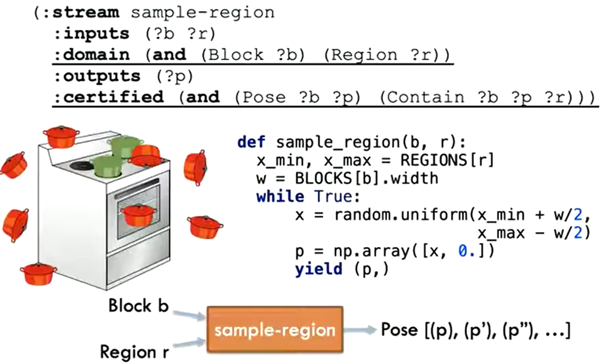

# PDDLStream: Integrating Symbolic Planners and Blackbox Samplers via Optimistic Adaptive Planning

本质上是用 Fask Downward 做 Task Plan，但是 predicate 的变量中可以包含连续值。

为了求解这些连续值，提出了 Stream 的概念。Stream 类似 Action，需要人为定义其功能，例如输入一个物体和一个 region，输出一个在这个 region 中可以放这个物体的位置，来作为 place 动作中的参数。

一个 Stream 的例子

文章提供了扩展 PDDL 语法，来像声明 Action 那样声明 Stream，然后用 Task Plan 算法求解，这样 Solution 中就包含了由 Stream 提供的连续值，例如抓取位置，放置位置，之类之类。

这些连续值作为 Motion Plan 的输入，完成最终的执行。