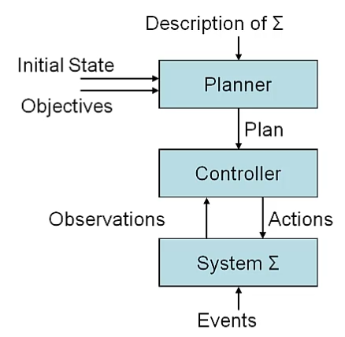

# Introduction of Planning and Search
## What is planning
Planning 定义
- 根据行为的预期结果，对行为进行明确的选择和组织的过程 （An explicit deliberation process）。这里的 explicit 是和 “subconscious 下意识地” 相对的。
- 目的是达成一定的预先确定的目标
AI Planning 定义
- 对于 Planning 这一个计划过程进行计算的相关研究。

## 两类 Plan 问题
- Doman-specific planning，例如 path planning，communication planning，manipulation planning。通常包含了特定的算法来解决特定的问题。
- Doman-independent planning，对 Planning 给出一般化的表示和方法。

## Conceptual Model
Planning 通常被建模成一个 State-Transition System （状态机）$\Sigma = (S, A, E, \gamma)$
- $S = \{s_1, s_2, ...\}$ 状态集合
- $A = \{a_1, a_2, ...\}$ Actions，是 plan 对象（agent）可以做出的行为的集合
- $E = \{e_1, e_2, ...\}$ Events，Plan 的场景（World）中会发生的事件，但是并不受对象控制。Events 和 Actions 都可能改变场景的状态。
- $\gamma : S\times(A\cup E) \rightarrow 2^S$，状态转移函数，函数以状态和造成状态改变的行为或者事件为输入，得到改变后的状态。需要注意的是，转移函数的输出本身是一个状态集合，所以表示这个集合的集合的时候用了 $2^S$。
  - 如果 $\gamma(s, a) \neq \emptyset$，我们称 $a$ 在状态 $s$ 中是可执行的 applicable

状态集模型也可以用图来表示 $G = (N_G, E_G)$
- 每个节点代表一个状态，也就是说 $N_G = S$
- 如果 $\exist u\in (A\cup E)$，使得 $s'\in \gamma(s, u)$，那么节点 $s$ 和 $s'$ 之间就存在边 $u$。（显然这个图可以有重边）

整个 Plan 和 Plan Execution 的抽象过程可以由下图所示

 我是图

但是实际场景和 plan 所使用的场景描述一般来说不是一致的，描述的过程通常包含了对场景的抽象化。另外，在实际的 plan 过程中通常需要 Dynamic Plan，也就是交替 Plan 和 Execution 的过程，做到
- Plan supervision：Controller 需要能感知 Observation 和 Plan 预期结果之间的差异
- Plan revision：Conroller 尝试修正现有 Plan 从而能够适应新的状态
- Re-planning：Controller 无法应对当前情况，所以将执行情况 Execution Status 反馈给 Planner 来重新规划。

## Search Problem
Search Problem 的组成
- 初始状态 initial state
- 行为 actions 和行为对应的执行条件
  - successor function: $state \rightarrow \text{ set of }<action, state>$。successor 将每个状态映射到该状态下可以执行的 action 以及执行结束后所处的状态，换句话说它给出了整个系统的 applicability conditions 信息。（之所以叫做 successor function，是因为后面的 Search Tree 用这个 function 来得到当前 Search Node 的后继节点）
  - successor function + initial state = state space
- goal 目标，Search Problem 的目标可以是一个特定的状态，也可以是一个检测状态是否满足目标的函数。
- path cost function，路径的 cost，通常是为了优化结果。我们可以假定一条路径的 cost 是每一步 cost 的和。

在 Plan 问题中，问题构成和定义本身就是一个很困难的事情，我们必须决定对问题进行什么程度的抽象。

对于 Plan 问题来说，对整个系统包含以下假设
- 系统的状态是有限和离散的
- 系统是完全可观测的
- 行为的结果是确定的
- 没有 Events

其他假设
- 目标是严格定义的，可以是特定状态，或者状态的集合
- 求解的结果是一系列 action （sequential plans）
- 不考虑行为执行时间
- plan 过程是离线的，不考虑系统在 plan 过程中发生变化。

## Search Algorithms
数据结构：Search Tree & Node，每一个节点包含以下信息
- state，需要注意的是两个 node 可能由相同的 state
- parent node
- action，是在 parent node 执行的 action，执行结束后到达当前 node （这样就可以包含 successor function 的完整信息。）
- path cost，到达当前 node 的总 cost
- depth，节点在 search tree 中的 depth

一个 Search Tree 可以表述一个 Search Problem。

**Search Tree 和 Plan Graph 是不同的数据结构。Search Tree 可以理解为在 Plan Graph 中的搜索过程，它是搜索过程本身，而不是说必须先构建 Search Tree 才能在这个 Tree 上进行搜索。Plan Graph 可能是有环的，在这样的 Graph 中搜索所得到的 Search Tree 可能是无限大的。**

### General Tree Search Algorithm
简单的前向搜索而已。

>**function** treeSearch(*problem*, *strategy*)
>   - *fringe* $\leftarrow$ { **new** searchNode(problem.initialState) } 
>   - **loop**
>       - **if** empty(*fringe*)
>           - **return** failure
>       - node $\leftarrow$ selectFrom(*fringe*, *strategy*)
>       - **if** *problem* goalTest(*node*, *state*)
>           - **return** pathTo(*node*)
>       - *fringe* $\leftarrow$ *fringe* + expand(*problem*, *node*)

从这里也可以看出，算法的输入并不包含 Search Tree，而是 problem 本身，Tree 是在算法执行过程中借助 expand 等方法逐渐生成的。如果算法中的 loop 是一个死循环，那么就会得到一个无限增长的 search tree。

Search or Control Strategy: 即前面算法中的 selectFrom 策略，它的功能是调度 successor function 的使用，从而做到：
- 从 fringe 中选择接下来 expand 的节点
- 决定了节点 expanded 的顺序
- 最终目标是尽快得到 goal state
- 要求策略是高效的，不能占用太多时间

Search Strategy 的实现方式通常是把 fringe 中的节点放在特定的数据结构中，例如
- LIFO/FIFO 队列
- 字母序排序之类

由于 Search Tree 本身可能非常大，Search Strategy 可能还需要决定在内存中维护哪一部分 Search Tree。