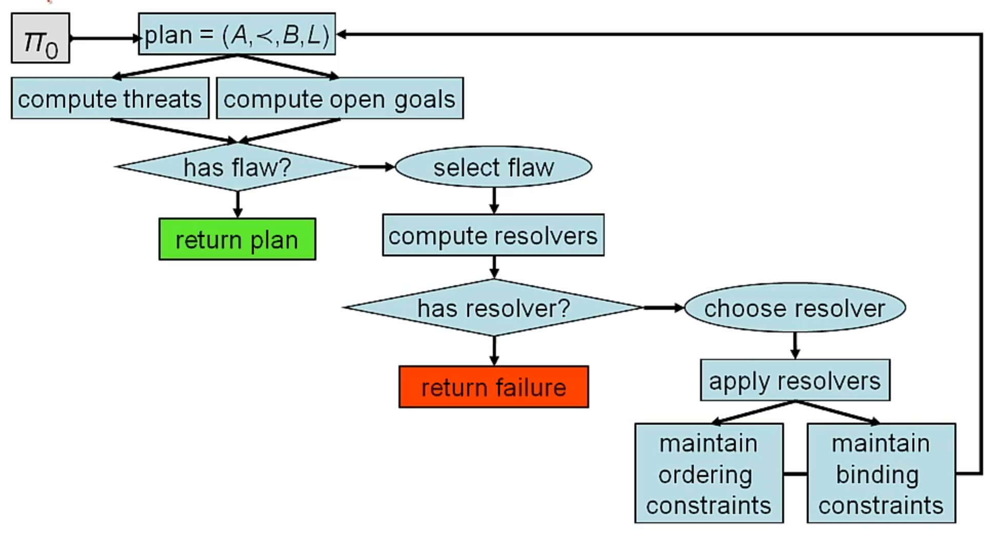

# PSP Algorithm
Plan-Space Planning Algorithm。

算法的基本想法就是前面说过的，在保持 $\prec$ 和 $B$ 的合法性前提下减少 flaw。基本流程如下
- 找到当前 $\pi$ 中的 flaw
- 选择一个 flaw
- 找到解决这个 flaw 的方法，该方法被称为 resolver。resolver 必须保持 $\prec$ 和 $B$ 的合理性。
- 选择一个 resolver
- 根据选定的 resolver 优化 $\pi$

需要注意的是，对 resolver 和 flaw 的选择策略是不同的
- $resolver\leftarrow allResolvers.\text{chooseOne}$
  - non-deterministic choice
  - 如果一个不行，那么就剪枝并且尝试下一个
- $flaw \leftarrow allFlaws.\text{selectOne}$
  - deterministic selection
  - flaw 都需要去掉，去掉的顺序不影响正确性，但影响算法效率
  - 不会回过头来解决无法满足的 flaw。

## Implementation
### $plan.\text{openGoals}()$
获取当前 partial plan 中还没有达成的 sub-goals。以 incrementally 的方式实现
- 初始时为所有 goal conditions
- adding action 的时候，添加所有 preconditions
- adding causal link 的时候，移除所有被 proposition 维护的 sub-goal

### $plan.\text{threats}()$
获取当前所有 threats，同样是 incrementally 实现
- 初始时没有 threats
- adding action 的时候：检查当前每一个 causal link $\langle a_i - [p] \rightarrow a_j \rangle$
  - 如果 $(a_{new} \prec a_i)$ 或者 $(a_j \prec a_{new})$，那就检查下一个 causal link
  - 否则，对于 $a_{new}$ 的每一个 effect $q$
    - 如果 $(\exist \sigma: \sigma(p) = \sigma(\neg q))$ 那么 $q$ 就是该 causal link 的一个 threat。也就是说有 variable 取值可以让 $p$ 和 $\neg q$ 相同。
- adding causal link 的时候
  - 对已有的所有 action 用上面的方法判断 threaten。需要注意的是，作为 provider 和 consumer 的 action，只有 provider 需要检查。

### $flaw.\text{getResolvers}(plan)$
获取 flaw 的解决方法。

对于某个 action $a_g$ 中未满足的 precondition $p$，我们需要找到一个合适的 provider
- 添加新的 causal link 来消除 flaw，核心在于找到 effect 可以满足 $p$ 的 action
  - for $a_{old} \in A$
    - if $(a_g = a_{old})$ or $(a_g \prec a_{old})$ continue
    - else for effect $q$ of $a_{old}$
      - if $(\exists \sigma: \sigma(p) = \sigma(q))$ then
        - 添加 causal link $\langle a_{old} - [\sigma(p)] \rightarrow a_g\rangle$ 作为 resolver
- 添加新的 action 和 causal link，即用一个新的 action 来满足 $p$，并且添加对应的 causal link
  - for $(\forall \text{ operator } o \text{ and its effect } q)$
    - if $(\exists \sigma: \sigma(p) = \sigma(q))$ then
      - 添加 $a_new = o.\text{newInstance}$ 和 $\langle a_{new} - [\sigma(p)] \rightarrow a_g\rangle$ 作为 resolver

对于作为 causal link $\langle a_i - [p] \rightarrow a_j\rangle$ 的 threat 的 $a_t$ 的 effect $q$
- 添加 order constraint，让 $a_t$ 在 $a_i$ 之前执行
  - if $(a_t = a_i)$ or $(a_j \prec a_t)$ then order 冲突不能添加
  - else 添加 $(a_t \prec a_i)$
- 添加 order constraint，让 $a_t$ 在 $a_j$ 之后执行
  - if $(a_t = a_i)$ or $(a_t \prec a_i)$ then order 冲突不能添加
  - else 添加 $(a_j \prec a_t)$
- 添加新的 variable binding 限制，从而让 $q$ 和 $p$ 不同
  - for every variable $v$ in $p$ or $q$
    - if $v\neq \sigma(v)$ is consistent with $B$ then
      - adding $v\neq \sigma(v)$

### $plan.\text{refine}(resolver)$
执行上面得到的 resolver 并且更新 flaws

## Maintaining Ordering Constraints
Ordering Constraints 需要支持两个基本操作
- query $(a_i\prec a_j)?$
- add $(a_i\prec a_j)$

为了能够实现快速的 query，存储 ordering constraints 的时候通常不是存储原图，而是存储原图的 transitive closure，尽管这样会一定程度上损失 add 的效率。  

- [Wikipedia Transitive Closure](https://en.wikipedia.org/wiki/Transitive_closure)
- [BGL Transitive Closure](https://www.boost.org/doc/libs/1_46_1/libs/graph/doc/transitive_closure.html)

## Variable Binding Constraints
Constraint 主要有三类
- unary constraints: $x\in D_x$
- equality constraints: $x=y$
- inequalities: $x\neq y$

这就构成了一个约束满足问题 CSP。而上述约束条件中的 inequalities 是指数复杂度的。

## PoP Planner
PSP 的一种实现。