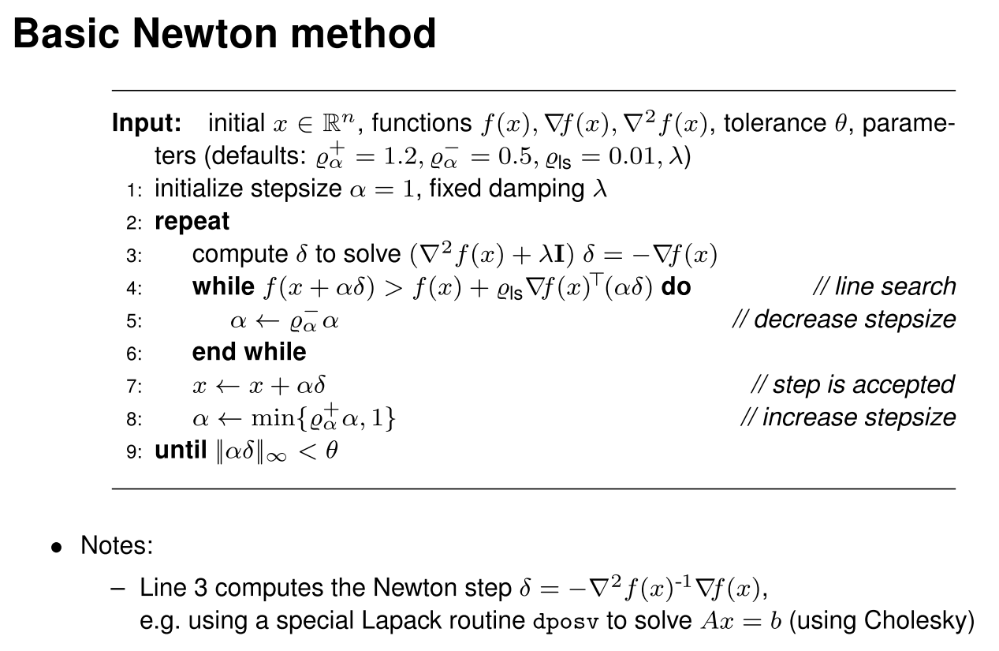

# Optimization
优化问题的通用形式

$x\in \mathbb{R}^n$, $f: \mathbb{R}\rightarrow\mathbb{R}$, $g: \mathbb{R}^n\rightarrow \mathbb{R}^m$, $h: \mathbb{R}^n\rightarrow \mathbb{R}^l$ Find

$$\begin{aligned}
    \min_x~~~&  f(x) \\ 
    \text{s.t.}~~~&  g(x) \leq 0, h(x) = 0
\end{aligned}$$

- f(x) 的不同性质决定了优化的求解方式，主要是 f(x) 的可微性。
- 可以通过 $f(x)$ 的采样计算 $\nabla f(x)$ 的局部值
- 可以通过 $\nabla f(x)$ 的采样计算 $\nabla^2f(x)$ 的局部值

## Unconstraint Optimization
最基本的基于梯度下降的优化
- Gradient Vector: $\nabla f(x) = \left[ \frac{\partial}{\partial_x}f(x) \right]^T$
- 每次根据 stepsize $\alpha$ 更新 $x$ 值： $x \leftarrow x - \alpha \nabla f(x)$
- 直到变化小于 tolerance $\theta$: $|\Delta x| < \theta$

### Backtracking Line Search
是一种自适应步长 stepsize 的优化算法。基本想法是，对于凸函数，小步长可以保证得到最优解，但是希望尽量大的步长来加快收敛，所以从大到小搜索合适的步长。

<!--
已经知道梯度方向 $\nabla f(x)$ 的情况下，定义步长的方向为 $\delta = -\frac{\nabla f(x)}{|\nabla f(x)|}$。我们希望找到一个合适的步长参数 $\alpha$，然后用 $\alpha\delta$ 作为步长。那么寻找合适的 $\nabla$ 可以看作是以下问题（当前处于 $x_c$）：

$$\min_{\alpha} \phi(\alpha):=f(x_c + \alpha\delta )$$
-->

### Newton Step
[知乎：牛顿法和拟牛顿法](https://zhuanlan.zhihu.com/p/46536960)

牛顿法简单说就是用泰勒级数前几项来近似函数的根。

$$f(x) = f(x_0) + f'(x_0)(x-x_0) + \frac{1}{2}f''(x_0)(x-x_0)^2 + ...$$

如果只取线性部分，那么在 $x_0$ 附近 $f(x)=0$ 的根近似为

$$x_1 = x_0 - \frac{f(x_0)}{f'(x_0)}$$

然后迭代求解。

对于最优化问题，可微函数 $f(x)$ 极小值点处的一个必要条件是 $\nabla f(x) = 0$，所以用牛顿法迭代求解 $\nabla f(x)$ 的根。

$$x_{n+1} \leftarrow x_n - \frac{\nabla f(x_n)}{\nabla^2f(x_n)}$$

从计算的角度，可以表示为 Jacobian 和 Hessian 矩阵的形式

$$x_{n+1} \leftarrow x_n - \frac{J(x_n)}{H(x_n)}$$

对于非凸函数，牛顿法可能跨过极值点。所以有时候会引入步长因子 $\lambda$，称为阻尼牛顿法

$$x_{n+1} \leftarrow x_n - \lambda_n\frac{J(x_n)}{H(x_n)}$$

> 关于正定矩阵：[知乎：浅谈正定矩阵和半正定矩阵](https://zhuanlan.zhihu.com/p/44860862)，[简书：线性代数知识点整理](https://www.jianshu.com/p/21aea5108d83)
> 
> 矩阵可以看作是一个线性变换，那么如果对一个**非零**向量应用这个线性变换，得到的新的向量和原来的向量在一个方向上，即 $Av = \lambda v$，就称这个向量 $v$ 是矩阵 A 的特征向量，$\lambda$ 叫做特征值。
> 
> 如果所有特征值都 $>0$，就说这个矩阵是正定的 positive definite，如果是 $\geq 0$，那就叫半正定的 semi-positive definite。
> 
> 直观上，$\lambda v$ 的含义可以看作是 “矩阵所代表的线性变换让向量所产生的变化方向”。这和正定的另一个定义是一致的，即：
> 
> 若对于任意非零向量 $x$，恒有 $x^T A x>0$，那么称 $A$ 是正定的。
> 
> 在这个定义里面，$y=Ax$ 就是经过转换之后的向量，$x^Ty>0$ 意思就是，任何向量经过 $A$ 转换之后，新的向量和原本的向量夹角 $<\frac{\pi}{2}$。

牛顿法的一个要求是 Hessian 矩阵是正定的，这是因为多维情形下的 Taylor 展开为

$$f(x+h) = f(x) + J(x)\cdot h + \frac{1}{2}h^TH(x)h + O(h^3)$$

在取得极值点的附近，$J(x) \rightarrow 0$，那么有

$$f(x+h) - f(x) \rightarrow \frac{1}{2}h^TH(x)h$$

取得极小值的前提是 $f(x+h) - f(x) > 0$，所以 $H$ 正定。

从直观上说，正定指的是特征值 > 0，也指任意线性变换得到的新的向量夹角不会超过 $\pi/2$。对于二阶导数矩阵，这意味着二阶偏导数 $>0$，函数为 凸。

