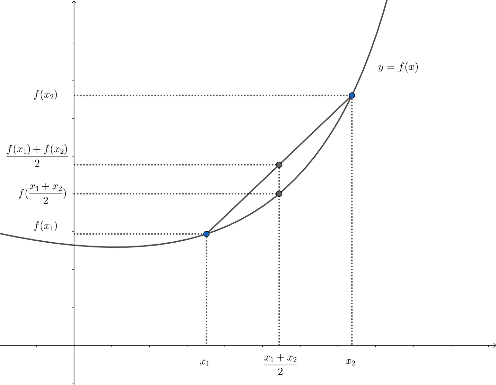

# 函数极值
## 向量函数无条件极值
$x_*$ 为函数 $f(x)$ 局部极小值点的必要条件：
- 若 $f(x)$ 在 $x_*$ 处一阶连续可微，则需要有 $f_x(x_*) = 0$
- 若 $f(x)$ 在 $x_*$ 处二阶连续可微，则需要有 $f_{xx}(x_*) \geq 0$

当 $f(x)$ 在 $x_*$ 处二阶连续可微时，$x_*$ 为 $f(x)$ 严格局部极小值点的充分条件为 $f_x(x_*) = 0$ 且 $f_{xx}(x_*) > 0$

## 凸集和凸函数
如果集合 $\mathbf{X}$ 里面任意 $m$ 个元素 $\xi_i \in \mathbf{X}$，对任意的 $\sum_{i=1}^m \lambda_i = 1, ~ \lambda_i\in[0,1]$ 都有

$$\sum_{i=1}^m \lambda_i \xi_i \in \mathbf{X} $$

则称 $\mathbf{X}$ 为凸集。

对凸集的理解：当 $m=2$ 的时候，$\lambda_1\xi_1 + \lambda_2 \xi_2$ 实际上是 $[\xi_1, \xi_2]$ 中间所有的点。

在 $\mathbf{X}$ 上的函数 $f$ 如果满足

$$f(\sum_{i=1}^m \lambda_i\xi_i) \leq \sum_{i=1}^m \lambda_if(\xi_i)$$

对凸函数的理解：类比凸集，$\lambda_1f(\xi_1) + \lambda_2f(\xi_2)$ 实际上是 $(\xi_1, f(\xi_1))$ 和 $(\xi_2, f(\xi_2))$ 连线上的点，凸函数实际代表 **定义域中任意两点连线组成的线段都在这两点的函数曲线（面）上方**。

对于凸函数来说，局部极小值点也是全局极小值点。

## 等式约束下的向量函数极值
[知乎：如何理解拉格朗日乘子法](https://www.zhihu.com/question/38586401)

求 $f(x)$ 在等式约束 $g_i(x) = 0$. $i=1,2,...,m$ 下的极值。
- $g(x) = [g_1(x), g_2(x), ..., g_m(x)]^T$ 称为约束函数向量
- $\mathbf{G} = \{x | g(x) = 0, \forall x\in \mathbf{G}\}$ 称为容许集

假设在 $x_1\in \mathbf{G}$ 是容许集里的一个取值，$f(x_1) = y_1$，其实是代表了 $f(x) = y_1$ 和 $g(x) = 0$ 图像相交于 $(x_1, y_1)$。

不同的 $y_1$ 取值实际上代表了一系列函数，每一个取值对应的函数和 $g(x)=0$ 的交点都是一个满足容许集的解，但不一定是极值。

当取得极值的时候，$f(x)=a$ 和 $g(x) = 0$ 的图像是相切的。相切也就是梯度向量平行，可以换句话说就是 $\nabla f = \lambda\nabla g$，更准确的形式是

$$\frac{\partial f(x_*)}{\partial x_i} + \sum_{j=1}^{m} \lambda_j \frac{\partial g_j(x_*)}{\partial x_i} = 0, ~~i=1,2,3,...,n$$

$n$ 是 $\mathbf{X}$ 的维度，即两个函数关于每个维度的偏导都平行。$\lambda = [\lambda_1~\lambda_2~...~\lambda_m]^T$ 称为 Lagrange 乘子。

定义 Hamilton 函数

$$L(x, \lambda) = f(x) + \lambda^Tg(x)$$

上述相切的时候的极值条件恰好就是 Hamilton 函数的极值条件，即 $f(x)$ 的等式约束下向量函数局部极小值问题可以转化为 Hamilton 函数的无约束局部极小值问题，其必要条件可以表述为

$$L_x(x,\lambda) = \frac{\text{d} f(x)}{\text{d}x} + \frac{\text{d}g^T(x)}{\text{d}x}\lambda = 0$$
$$L_\lambda(x, \lambda) = g(x) = 0$$

联立求解 $\lambda$， $x_*$ 即为极值。