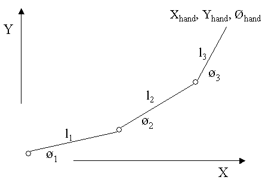

# Kinematics
机器人中研究Kinematics是指研究刨除力作用之外的机械臂的运动，可以包括位置、速度、加速度等。

## Forward and Inverse Kinematics
- [Wikipedia: Kinematics](https://en.wikipedia.org/wiki/Kinematics)
- [Wikipedia: Forward Kinematics](https://en.wikipedia.org/wiki/Forward_kinematics)
- [博客：什么事FK和IK](https://www.pianshen.com/article/94051093327/)

> Kinematics is a subfield of physics describes the motion of points, bodies (objects), and systems of bodies (groups of objects) without considering the forces that cause them to move.

这里的运动学方程指的是求解关节链变换和位置的方程。

## Forward Kinematics
正向运动学 Forward Kinematics 即从机械臂的 base link 一直到 tip link 逐级计算Transformation，最终可以得到末端的位置信息。例如下面的最简单的位于平面上的三关节机械臂

$$[T]=[Z_1][X_1][Z_2][X_2]...[Z_{n-1}][X_{n-1}][Z_n]$$

### Denavit-Hartenberg Model (D-H Model)
[YouTube: Denavit-Hartenberg Reference Frame Layout](https://www.youtube.com/watch?v=rA9tm0gTln8)

机器人坐标系定义和转换关系的模型。一般描述两个坐标系之间的关系要用到转移矩阵，或者说用到 xyznoa，而 D-H Model 用四个参数描述 $(a,d,\theta, \alpha)$
- Z 轴方向是转轴方向
- X 轴方向是两个 Z 之间的 Common Normal，X同时定义了原点位置。第一个 X 的方向可以任意。
- Y 轴按照右手坐标系定义
- $d_i$：Common Normal 之间的距离。如果两个 Z 平行，$d_i$ 值任意。
- $a_i$: Common Normal 的长度。有时也写做 $r$ 来和 $\alpha$ 区分。
- $\theta_i$：Common Normal 之间关于 Z 的角度。
- $\alpha$：Z 轴之间关于 Common Normal 的角度。

基于 D-H Model 进行两个坐标系的转换
- 首先沿着 Z 轴移动 $d$
- 然后沿着 Z 轴旋转 $\theta$，X 轴已经到了下一个 X 轴平行的方向
- 沿着现在 X 轴的方向运动 $r$，现在原点已经到了正确的位置
- 最后沿着 X 旋转 $\alpha$，从而将 Z 轴旋转到新的位置。

D-H Model 的坐标系定义不会受到实际机器人结构的影响，而只关心转轴。

基于 D-H Model 的转移矩阵计算

$$\begin{aligned}
A_n &= Rot(z, \theta_n)*Tran(0,0,d_n) * Trans(a_n, 0, 0) * Rot(x, \alpha_n)\\
&=\left[\begin{array}{c}
    \cos\theta_n & -\sin\theta_n\cos\alpha_n & \sin\theta_n\sin\alpha_n & a_n\cos\theta_n\\
    \sin\theta_n & \cos\theta_n\cos\alpha_n & -\cos\theta_n\sin\alpha_n & a_n\sin\theta_n\\
    0 & \sin\alpha_n & \cos\alpha_n & d_n\\
    0 & 0 & 0 & 1
\end{array}\right]
\end{aligned}$$

对于旋转轴，变量是 $\theta$，对于平行轴，变量是 $d$。

机械臂设计时，通常 $\alpha$ 会设定为 $\pi/2$ 或者 0。

所有轴合起来的转移矩阵为

$$T_N = A_1 * ... * A_N$$

### 转移矩阵的含义
根据前面的定义，转移矩阵用来是两个座标系间座标的转换矩阵

$${}^AP = {}^AT_B * {}^BP$$

将 Base 座标系标记为 0，end-effector 座标系标记为 $ee$，那么 $T_N$ 的本质是

$$T_N = {}^0T_{ee}$$

即，假设末端在 end-effector frame 中的座标是 ${}^{ee}P = (x_n, y_n, z_n, 1) ^ T$，那么，末端在 Base Frame 中的座标是 ${}^0P = T_N*{}^{ee}P$。所以有以下公式

$$POS=BASE*T_N*TOOL$$

这里的 $BASE$ 是 ${}^{world}T_0$，$TOOL$ 相当于上面提到的 ${}^{ee}P$。

## Inverse Kinematics
给出最终转移矩阵 $T_N$，求每个 $\theta$，如果包含平行轴可能还要求 $d$。

**Workspace**: end-effector 可以到达的空间

**Dexterous Workspace**：end-effector 可以以任意角度到达的空间

**Reachable Workspace**：end-effector 可以以至少一个角度到达的空间。

### Wrist Partition IK
即前三轴为旋转轴，后三轴为一个球形轴的机器人。这时前三轴可以负责位置，后三轴负责旋转，可以直接代数方法求解IK。