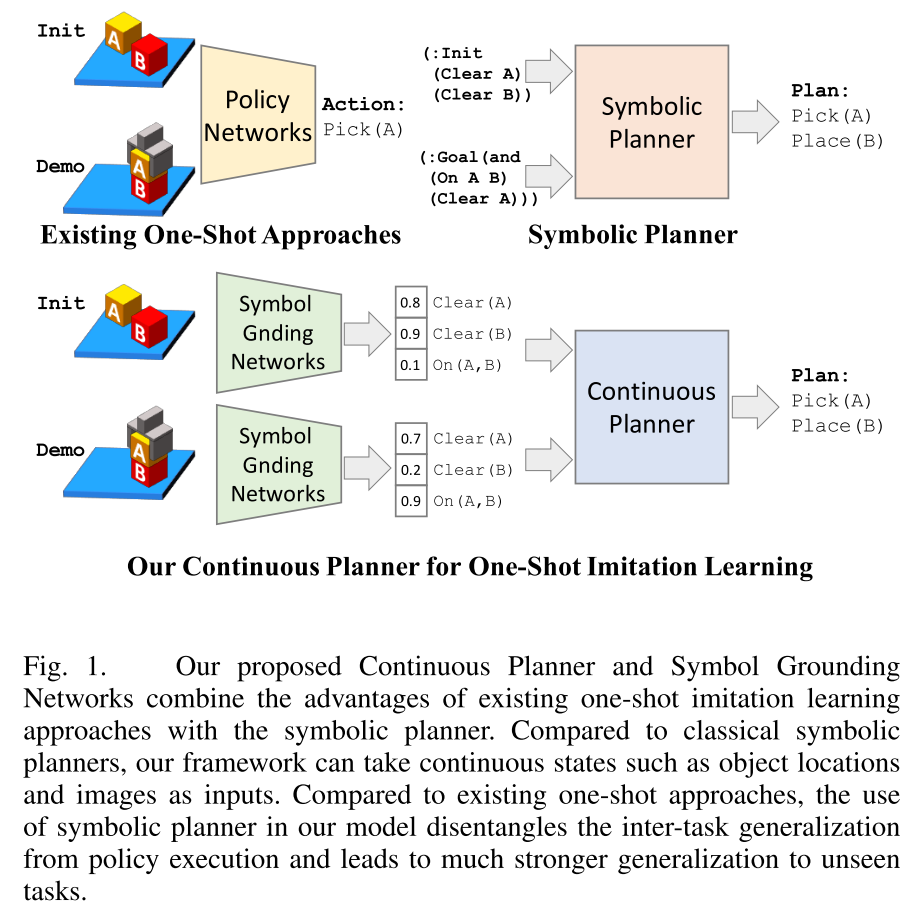
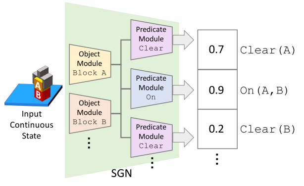

# Continuous Relaxation of Symbolic Planner for One-Shot Imitation Learning
One-shot imitation learning problem: 进通过一次示范就让机器人能够学会完成一个之前未见过的任务。

直观的解决方法是 meta-learning。但是随着整个 task 的步骤增多，环境变复杂，需要的 meta training 数据也就越多。

而对于 long-horizon tasks，更适用于基于规划的方法，通过 symbolic domain 的高度结构化数据，从而能够通过搜索解决 task plan。

本文的基本想法就是，将 inter-task generalization 和 policy execution 区分开来，深度学习模型只负责解决 inter-task generalization 问题，而将 policy execution 交给 planner 解决。从而能够极大提升算法对 task 的泛用性。

> We argue that it is much easier for the symbol grounding problem to achieve inter-task generalization compared to the black-box policy networks used in previous works because the symbol grounding function can be shared among the tasks in the same or similar domains.

## Symbol Grounding Network
输入 continuous state，例如图片，输出对应的 symbolic states.

比较特殊的一点在于，这里输出的 symbolic state 是连续的带有概率的，这是为了防止由于 symbolic state 的离散型放大误差，从而导致后续的 symbolic planner 求解不出结果。

## Continuous Planner
由于 SGN 输出的 state 是 probablistic 的，所以需要修改原本的 discret symbolic planner。

最直观的方法就是设定 threshold，但是这样并不能保证 symbolic state 是 valid 的。传统的 Planner 做法
- 定义当前的 symbolic state
- 找到 applicable actions
- 选择合适的 action
- Apply actions 得到新的 state
- 直到到达 goal state

然后本文要做的就是在 probabilistic predicate 的基础上定义上述内容
- Symbolic state 定义：
  - $Z(s)$，是在当前 state 下 estimate 到的每个 predicate 的分布。对于每个 atom g，可以得到其在该分布下取 true 的概率 $P_{Z(s)}(g)$
- Applicable Actions:
  - Applicable 的判断依据是 precondition 在当前 state 都满足，这里变成了 precondition 都满足的概率
  $$\sum_{s, \gamma(s,a)}Z(s) = \prod_{g\in Pre(a)}P_{Z(s)}(g)$$
  这里隐含了 predicates 之间互相之间条件独立 conditional independence 的假设。
- Action Application: 
- Goal Satisfaction: 