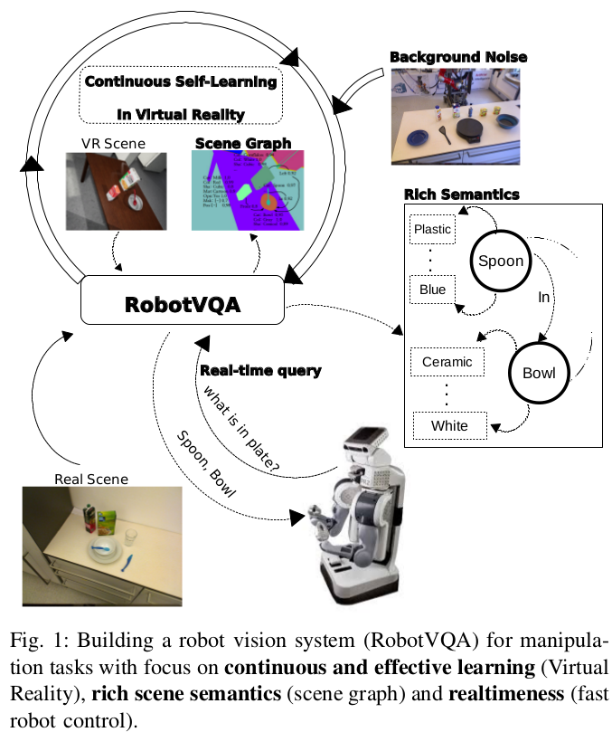

# RobotVQA — A Scene-Graph- and Deep-Learning-based Visual Question Answering System for Robot Manipulation
[github](https://github.com/fkenghagho/RobotVQA)

Robot Visual Questing Answering.

基于视觉感知的，在复杂、动态环境中的机器人操作。

核心挑战
- appropriate scene ontology. 需要对“场景”进行合适的定义，使得其具备两个特征
  - completeness: 完备性，场景中的 semantic 信息足够完成 manipulation 任务
  - structuredness: 结构化，场景信息需要高度结构化，从而能够被机器人使用。
- Uncertainty 非确定性：基于视觉的方法意味着噪声、精确度等等问题。想要从复杂视觉信息中得到好的场景理解意味着使用深度学习的方法，但是这同时带来了数据问题，没有合适的大规模数据用于训练。
- Realtimeness 实时性：
  - 视觉系统的实时性
  - 控制系统的实时性

## Method Overview
- dataset generator
  - scene generator: 基于先验知识生成 scene graph
  - VR scene generator: 将生成的 scene graph 在 VR 环境中重建出来。同时，VR engine 也维护了 VR semantic，包含物体 pose、mask、geometry、physics 等信息。为了便于后续学习结果向现实世界迁移，会在生成数据中混杂现实数据。
  - 导入 configuration，configuration 中包含了 robot trajectory 以及在该 trajectory 下场景应当怎样更新
- data collector，运行 simulation，获取场景图片作为数据集
- scene describer，从生成的数据集中进行深度学习
- robot manipulation: 运行，深度学习模型会持续输出 scene graph 以便控制程序 query

## Scene Describer
