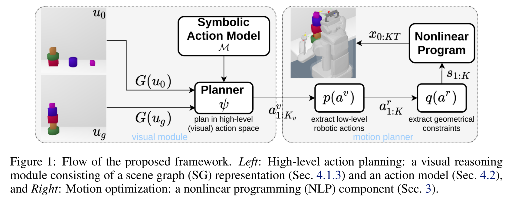
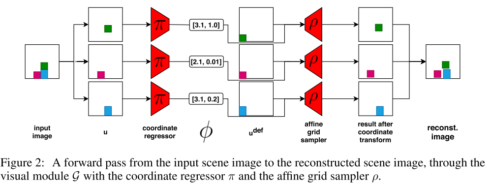

# Self-Supervised Learning of Scene-Graph Representations for Robotic Sequential Manipulation Planning

- Visual Module $\mathcal{G}$, 把视觉图像 encode 到两个 scene graph，作为 initial 和 goal state
  - 从 bounding box 中提取 feature，将 feature 映射到一个二维坐标系，可以粗暴的理解为物体的正面视图坐标。
  - 用 k-means 将物体聚类成 cluster，这里的 cluster 实际上是每一摞物体
  - rule base 的生成 cluster 之间和 cluster 内各物体之间的 relationship，其实就是简单的位置关系。
- Symbolic action model $\mathcal{M}$, 进行 high-level 的 plan
- NLP(non-linear programming) Solver， 用 LGP 的模型求解 action sequence 对应的 trajectory

Scene Graph 的 relation 只包含 $e\in\{\text{left}, \text{up}\}$，这也是用简单的位置关系就可以得到 scene graph 的原因。

可以处理 Blocks-world task 一类简单的 task plan 任务，但是对 scene graph 的构建方法和定义过于 naive，无法构建复杂的 scene graph，或者说无法得到足够的 relationship 语义来做复杂的 task plan。

## Visual Module

