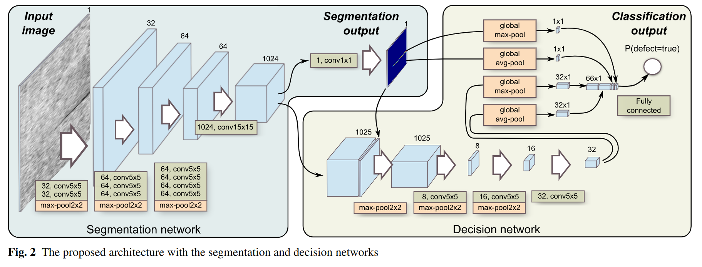

# Segmentation-Based Deep-Learning Approach for Surface-Defect Detection
[Project Page](https://www.vicos.si/research/surface-defect-detection/industrial-surfaces/)

任务场景是工业领域表面探伤。

文章核心出发点是支持小样本训练，基本逻辑是“一个 positive sample 样本对分类问题来说是一个样本，对分割问题来说一个像素是一个样本，所以要用 segmentation-based 的方法作探伤”。

所以整个网络的设计和训练和通常的CV网络是反过来的，一般的网络用 classification 作 pre-train，然后 fine-tune 到 segmentation 等任务。而本文中是先 from scratch 训练 segmentation 网络，然后训 classification 网络（文中叫 decision network，因为 segmentation 也被看作了样本数更多的分类问题）。

两部分网络的训练是完全分开的，现训练 segmentation，然后固定参数训 decision。

一起训也可以但是文中表示“不好调也没啥用”。

注意：
- 由于 pooling 直接用了 global pooling 所以输入图片尺寸可以任意。
