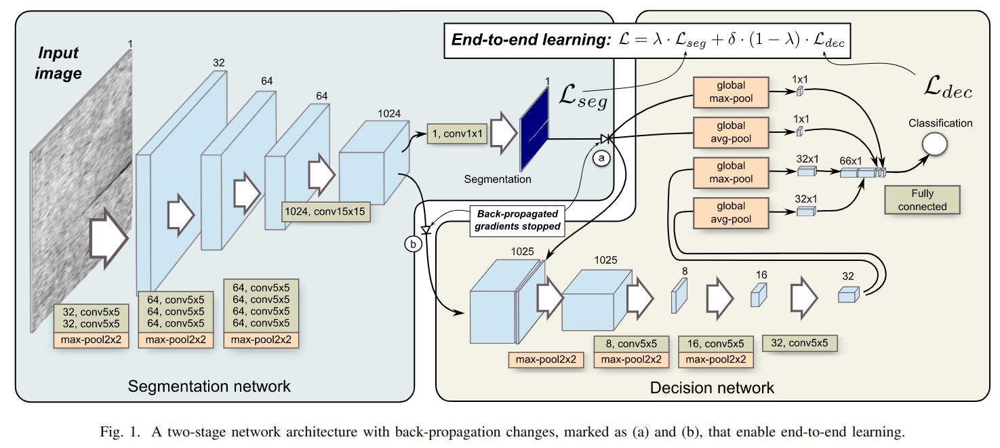

# End-to-end training of a two-stage neural networkfor defect detection
用一个同时作 segmentation 和 classification 的网络来做工业表面探伤。期望做到：
- ent-to-end，两个 stage 一起训练
- 用低质量的 annotation 训练。

网络用的依然是这个组之前的工作 Segmentation-Based Deep-Learning Approach for Surface-DefectDetection，修修补补又一篇。

## Combined Loss
为了同时训练 seg 和 cls ，把俩 loss 加在了一起

$$\mathcal{L}_{total} = \lambda\cdot \mathcal{L}_{seg} + \delta\cdot(1-\lambda)\cdot\mathcal{L}_{cls}$$

由于两个 loss 并不在一个尺度上，所以才有 $\delta$。segmentation loss 是对每个像素的 BCE loss 取平均，由于大多数像素都是正常像素，判断也正确，所以 loss 值会很低，所以 $\delta$ 的取值通常很小。

另外，$\lambda$ 并不是个定值，他的目的是让 "训练开始是主要训练 seg，训练快结束时之训练 cls"，所以随着训练进行，$\lambda$ 取值为

$$\lambda = 1-\frac{\text{current\_epoch}}{\text{total\_epoch}}$$

（这不就是分开训练...）

## Loss Weighting for Positive Pixels
探伤数据集的 label mask 通常很粗略，而不是 pixel accurate。例如一条划痕，在 mask 上可能是一个很宽的长方形。因此本文在计算 loss 的时候，对于 mask 中心的像素给予更高权重，而对于边缘像素给予低权重。权重最小值出现在 mask 边缘，而对于原本非 mask 的区域权重值反而比 mask 边缘大。这是因为 false-positive 比边缘不准确更加严重。

# Implementation
save_for_backward

loss: nn.BCEWithLogitsLoss, 即一个 sigmoid 层加上一个 BCELoss。