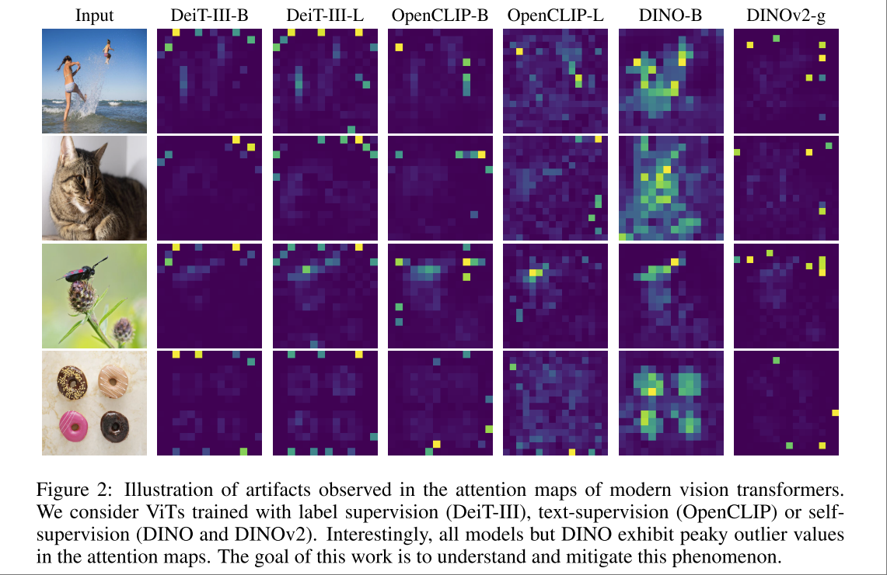

# Vision transformers need registers

使用 additional tokens 来去掉 ViT Backbone Model 的 feature map 中的伪影 （artifacts）。

文章用一系列 probing 方法首先发现了伪影有以下特征 （DINOv2）

1. L2 norm 大。 上面的可视化就是 L2 norm value，本文将这些 high-norm 称作 outlier 异常值。

2. 倾向于出现在更深的 layer 中。(下图a) 在训练一定步数之后才会出现。（下图b） 模型越大反而越容易出现。（下图c）

3. 异常值和周围位置的 cosine similarity 很高，也就是信息是冗余的。

4. 包含很少的局部信息，很难从这些异常值直接训练 pixel reconstruction 或者 position prediction 模型。

5. 包含更多全局信息，可以从异常值训练 image classification

一个直观上的感受是，这些 outlier 类似是模型在不重要的 patch 里记的 “笔记”。那么去除这些伪影的方法就很直观了：训练的时候提供用来记笔记的 token，并随着训练逐渐 drop 掉这些笔记。文章里把这些笔记用token称为 register （寄存器）。

> Having made these observations, we make the following hypothesis: large, sufficiently trained models learn to recognize redundant tokens, and to use them as places to store, process and retrieve global information. Furthermore, we posit that while this behavior is not bad in itself, the fact that it happens inside the patch tokens is undesirable. Indeed, it leads the model to discard local patch information (Tab. 5b), possibly incurring decreased performance on dense prediction tasks.

## Method

Register 的设计和 CLS Token 类似，是一个 Learnable Token.

需要注意的是，尽管 Register 位置的输出不会产生梯度，但是由于其参与了 self-attention，其实际上是会影响模型输出的。其作用就是字面意义上的寄存器。

本文前半部分说明模型需要额外的位置来寄存信息，后半部分发现可以认为提供这样的寄存器。

## 其他

也有最新的研究指出寄存器不一定要在训练阶段就使用，也可以直接在 inference 的时候通过一些手段做到类似寄存token的效果

[2025 arxiv] Vision Transformers Don't Need Trained Registers