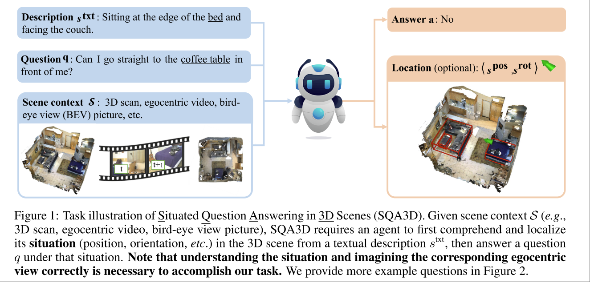

# SQA3D: SITUATED QUESTION ANSWERING IN 3D SCENES

Xiaojian Ma. Siyuan Huang.

本文并不是提出新的方案，而是提出新的任务，也就是 “Situatetd Question Answering in 3D Scene”，并且给出了一个数据集。

Task: 给定一个场景描述 $\mathcal{S}$，其中可能包含视频、BEV picture，一句对现状的描述 $s^{txt}$，一句提问 $q$。agent 给出一个回答和一个 location。