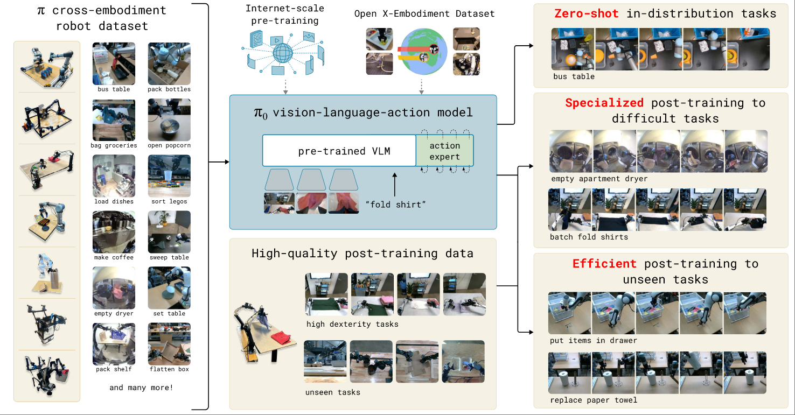
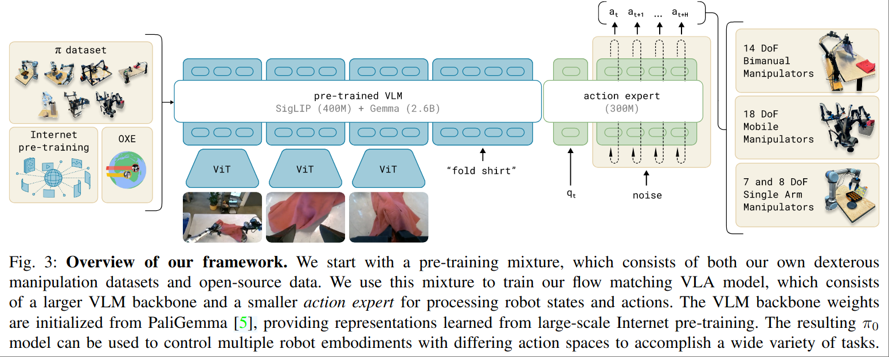

# π0: A Vision-Language-Action Flow Model for General Robot Control

Pi0 Paper

核心思路是用一个 Action Expert 代替纯粹的 LLM Model 来输出 Action。

## Action Expert

独立的权重，robot space action，并且使用 flow matching 训练。pi0 的一个核心发现就是 action 和 language 并不适合在一个 space 下处理，用单独的 space 和单独的权重来处理 action 可以得到好得多的效果。

pi0 的 Action Space 为

$$
\mathbf{A}_t = [a_t, a_{t+1}, ..., a_{t+H-1}],~~H=50
$$

Observation 则包含了 t 时刻的机器人 state，2~3张图片，以及一个 language instruction

$$
\mathbf{o} = [I_t^1,...,I_t^n,\mathcal{l}_t, q_t]
$$

图像和 state $q_t$ 都会经过 encoder 处理，投影到和语言一样的特征空间。

训练目标是 action 的 conditional flow matching loss

$$
L^\tau(\theta) = \mathbb{E}_p(A_t|o_t)\lVert v_\theta(A_t^\tau, o_t) - u(A_t^\tau | A_t) \rVert
$$

这里的 $\tau$ 是 flow matching 中的 continuous timestep.

Action Expert 的参数量为 300M，而用于理解图像和指令的 PaliGemma 参数量为 3B。也就是说只使用 1/10 的参数量来搭了一个 action expert。

尽管文章没有提，但看起来 action 并没有使用 latent space，而是直接在 joint angle space 下进行 flow matching。

## KV-Cache

Pi0 并没有使用传递 feature/token 的方式来使用 VLM 中的信息，而是直接使用 VLM 中的 KV Cache。更具体来说

1. 每次 forward 会计算并缓存 Paligemma 部分的 KV
2. 这部分 KV 同时也是 Paligemma 本身理解图像和语言时候使用的 KV，没有使用独立的 $W_K$ , $W_V$ 权重
3. 每一层的 KV Cache 都会被缓存，而不是只取特定层。
4. Action Expert 是一个 Denoise 模型，对于不同的 denoise time stamp $\tau$ ，复用相同的 Paligemma KV
5. Paligemma 和 Action Expert 都参与 VLA 的训练，只是两者都是一个预训练模型，且这两个预训练模型的空间是一致的 (Paligemma 和 Gemma, Paligemma 本质上是将 ViT 的空间投到 Gemma 空间之后得到的模型)。换句话说 $W_K,W_V,W_Q$ 都会正常由操作数据训练。

## Non-VLM Baseline

pi0 额外搭建了一个没有 VLM 的 Baseline Model，只包含 470M 的参数。这个模型也并不是完全 from scratch 训练的，而是使用 DistilBERT 对 language 进行 encode 再处理。

这个 Baseline 在文章中讨论几乎没有。
