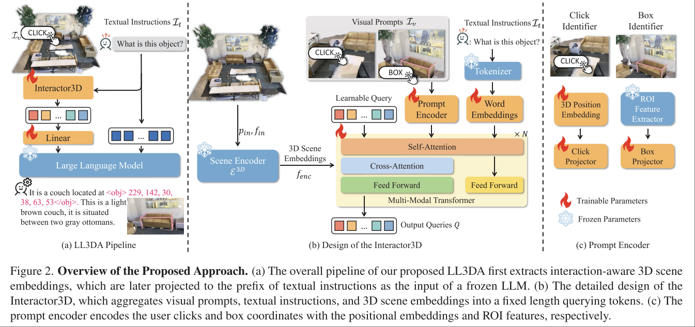

# Ll3da: Visual interactive instruction tuning for omni-3d understanding reasoning and planning

Sijin Chen. Tao Chen. 复旦

https://github.com/Open3DA/LL3DA

Task: Large Language 3D Assistant，直接输入 Point Cloud，可以对 text instruction 和 visual interaction 进行响应

本文最终给出的本质上是一个输入 Point Cloud，输出 language embedding 的大模型。由于 LLM 本身 weight 是固定的，因此可以使用不同的 decoder only LLM 来作为语言模型，训练后得到的就是一个将 Point Cloud 提取到该模型对应的 embedding space 的 LL3DA 模型。