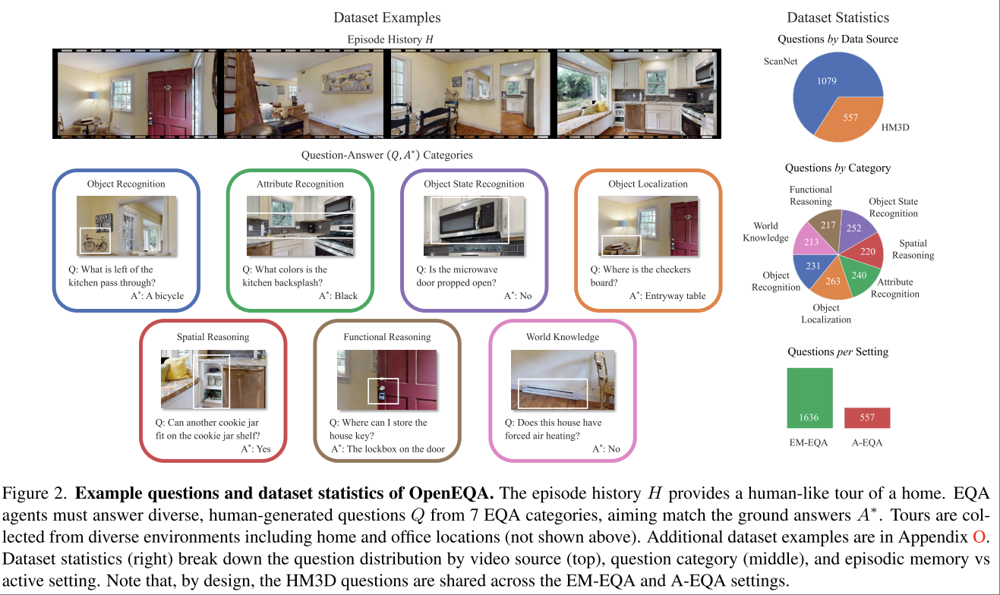

# OpenEQA: Embodied Question Answering in the Era of Foundation Models

Arjun Majumdar. Anurag Ajay. Xiaohan Zhang.

https://open-eqa.github.io/

> Simply put, EQA is the task of understanding an environment well enough to answer questions about it in natural language

**survey 一下有没有解决该 benchmark 中 A-EQA 问题的工作。**

提出了一个 BenchMark 来做 Embodied Question Answering 任务。该 Benchmark 关注的任务可以分为两部分
- Episodic Memory (EM-EQA): 输入图片序列，希望利用序列中所包含的 episodic memory 信息，来回答问题。其应用场景类似于人类带着智能眼镜，然后时不时问智能眼镜问题。
- Active Exploration (A-EQA): mobile robots that can autonomously explore environments to gather information to answer questions.

需要注意的是，本文的 EQA 问题只包含以下七类
- Object Recognition `What is left of the kitchen pass through?`
- Attribute Recognition `What colors is the kitchen backsplash?`
- Object State Recognition `Is the microwave door propped open?`
- Object Localization `Where is the checkers board?`
- Spatial Reasoning `Can another cookie jar fit on the cookie jar shelf?`
- Functional Reasoning `Where can I store the house key?`
- World Knowledge `Does this house have forced air heating?`

## EM-EQA

where an agent must develop an understanding of the environment from its episodic memory to answer questions.

每个 EM-EQA Instance 被定义为 $(Q, H, A^*)$
- $Q$: `I can’t find my keys, where did I leave them?`
- $H$: history of observattion，图像序列。
- $A^*$: `On the kitchen island.`

benchmark 中的 $A^*$ 是人类对该问题的回答，而 agent 的任务是给出和 $A*$ “similar” 的回答，至于是不是 Similar，是由大模型判断的。

## A-EQA

where an autonomous agent can answer questions by taking exploratory.

本 benchmark 中所有的 A-EQA 任务都可以 **只通过 Navigation Action** 完成。

## 应用

EM-EQA 部分被一些 VLM 用来训练空间理解能力，以及作为 evaluation set。

A-EQA 暂时没看到应用。