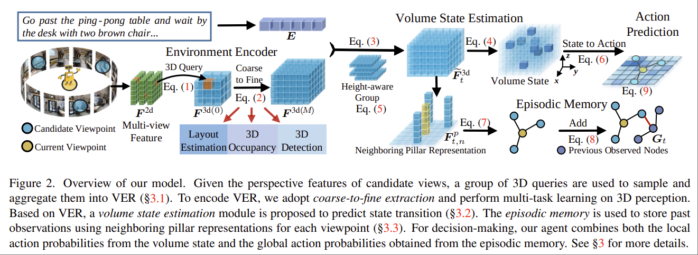

# Volumetric Environment Representation for Vision-Language Navigation
浙大 Rui Liu, Wenguan Wang, YiYang
https://github.com/DefaultRui/VLN-VER

VLN-VER

没有看到 website 或者 demo。

Task: 离散的 navigation。
- 场景中有离散的已知的 viewpoints 和 connectivity nodes
- action space 为 $\mathcal{A_t}\in \mathbb{R}^{N_t+1}$，从 $N_t$ 个 candidate views 中选取一个，或者采取 stop。
- 语言指令类似于 "Turn around and go passed the couch. Cross the hall to the sitting room. Turn left and enter the bedroom on the left. Wait near the bed."

基本想法：将 voxel map 引入到 VLN 任务中，把 2D Feature extract 到 3D voxel 中，并且让 agent 直接从 volumentric representation 中推断 occupancy, room layout, bounding box 等信息。

## Methodology

