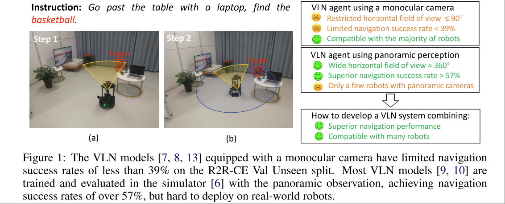

# Sim-to-Real Transfer via 3D Feature Fields for Vision-and-Language Navigation

Zihan Wang. Shuqiang Jiang.

https://github.com/MrZihan/Sim2Real-VLN-3DFF

25年新的工作： [g3D-LF](https://github.com/MrZihan/g3D-LF)

> In this field (VLN) , the agent is usually trained and evaluated in the navigation simulators, lacking effective approaches for sim-to-real transfer. 

尽管开头就指出了希望解决 sim-to-real 的问题，但是实际的解决方案却是使用普通配备单目相机 monocular camera 的真机达到 sim 中全景相机 panoramic 训练的 VLN Model 的效果。感觉，target 非常独特。

> Our goal is to design a VLN system that enables robots with only a monocular camera to achieve near-panoramic perception, ensuring both practicality and high performance

本文的目标如下图所示。

## Methodology

