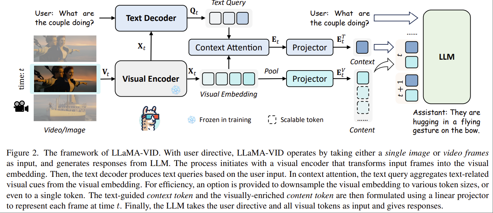

# 2024 ECCV LLaMA-VID: An Image is Worth 2 Tokens in Large Language Models
CUHK. Yanwei Li. Jiaya Jia.
https://llama-vid.github.io/

Task: 将 VLM 扩展到 Video 处理。

核心思路：对于视频的每一帧，提取两类 token，context token, content token。
- context token: 整个视频的信息
- context token: 每一帧的信息

Challenge: 所有的 ViT model 都是将 image 按照 patch 进行理解，VLM 将 patch 的信息和 language 空间对齐，得到对应的 image token。对于每一个图片，得到 32 或者 256 这个数量级的 vision token。如果直接用该方式处理视频，那一个 10s 的 30FPS 视频就会包含 300*256 个 token，数量过多无法提取有效信息。

## Methodology




```python
# B: batch size; C: channel size; n: content shape
# M: query length; N: shape of flatten image pacthes;
# text_q: text query in shape (B, M, C)
# vis_embed: visual embedding in shape (B, N, C)
# Key part 1: calculate context-related embedding
ctx_embed = text_q @ vis_embed.transpose(-1,-2)
ctx_embed = ctx_embed / (vis_embed.shape[-1]**0.5)
ctx_embed = (ctx_embed.softmax(-1)@vis_embed).mean(1)
ctx_embed = self.ctxproj(ctx_embed[:,None])
# Key part 2: calculate visual embedding
cur_shape = int(vis_embed.shape[1]**0.5)
vis_embed = vis_embed.reshape(B, cur_shape, -1, C)
vis_embed = F.avg_pool2d(vis_embed.permute(0,3,1,2),
kernel_size=cur_shape//n, stride=cur_shape//n)
vis_embed = vis_embed.permute(0,2,3,1).flatten(1,2)
vis_embed = self.visproj(vis_embed)
# concat token in shape (B, n+1, C), n in [1,N]
final_token = torch.cat([ctx_embed, vis_embed], dim=1)
```

- 输入视频帧 $V_t\in \mathbb{R}^{H\times W\times 3}$
- 通过一个 ViT 输出 Vision Embedding $X_t\in \mathbb{R}^{N\times C}$，N 是 patch number，C 是 channel depth
- 使用 Q-Former 或者 BERT 得到 text-guided query $Q_t\in\mathbb{R}^{M\times C}$。"the text query Qt contains highlighted visual cues that are most related to the user instruction."
- 使用前面得到的 text-guided query 提取 Vision Embedding 中的信息。$E_t = \text{Mean}(\text{Softmax}(Q_t\times X_t^T)\times X_t) \in \mathbb{R}^{1\times C}$。