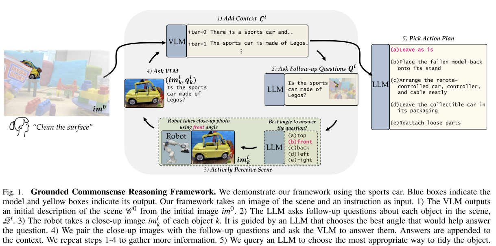

# Toward Grounded Commonsense Reasoning

Minae Kwon.  Dorsa Sadigh

(23 年的工作)

https://minaek.github.io/grounded_commonsense_reasoning/

> To reason in the real world, robots must go beyond passively querying LLMs and actively gather information from the environment that is required to make the right decision.

Task: 桌面整理，但是机器人需要主动的获取桌面信息，以确定该如何整理桌面。
- 专门设计了需要对物体按照常识确定如何整理的场景。
- 依靠反复 query LLM 来作为常识来源，没有 demonstration 与 human feedback
- 常识指的是 “我是否该收拾 xxx 物体”，或者 “xx 物体是否有遮挡”
- 允许机器人与环境交互。
- in-context learning

局限性
- 场景和任务都非常刻意与单一。
- 本文的任务似乎可以直接通过 VLM 来达成。但是文章表示当前的 VLM 的能力不足以提供足够的常识信息，所以依然是反复 query LLM。
- 本文自己提出了数据集，真机实验也是在数据集相似的环境中进行。
- 本文的方案很像是 TidyBot，算是在 LLM 应用到 robotic 初期才能够做的东西 (2023年6月)

## Methodology

