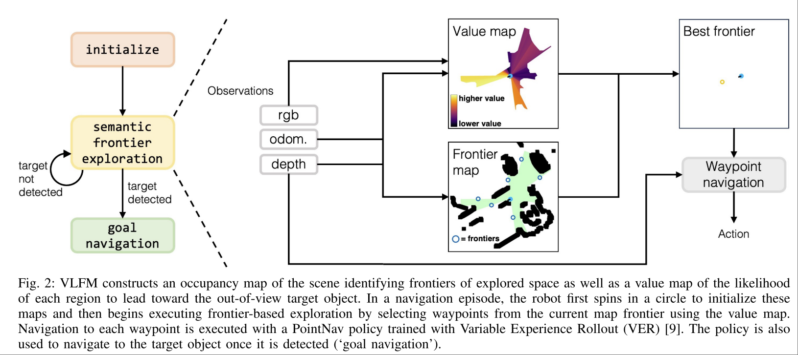
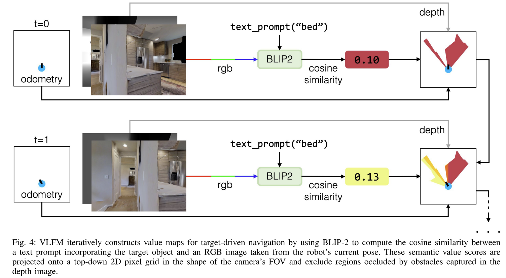

# VLFM: Vision-Language Frontier Maps for Zero-Shot Semantic Navigation

Naoki Yokoyama. Bernadette Bucher

ICRA 2024 Best Paper.

https://naoki.io/portfolio/vlfm

Core Idea: 用 VLM 做到 ZERO Shot VLN。
- 不需要针对任务进行训练
- 不需要预构建任何 map
- 不需要对周围环境的先验知识

> Understanding how humans leverage semantic knowledge to navigate unfamiliar environments and decidew here to explore next is pivotal for developing robots capable of human-like search behaviors

Task: target-driven semantic navigation to an unseen object in a novel environment
- Target-driven: 指令是 target object
- unseen: 当前视角里不可见的物体。（但是一定可以通过 navigation 看到的物体，例如床）

最终效果能做到直接在现实的室内场景中部署，按照语言所指定的 target object，探索环境并到达目标旁边。

## Problem Formulation

- 寻找不在视野中的物品（物品类别，不对 instance 做区分），例如 `bed`
- 机器人具有以下 sensor
    - egocentric RGB-D camera。提供视觉信息
    - odometry sensor，里程计，提供机器人当前的 位置、朝向、高度等信息
- Action Space
    - `MOVE_FORWARD(meters)`
    - `TURN_LEFT(degrees)`
    - `TURN_RIGHT(degrees)`
    - `LOOK_UP(degrees)`
    - `LOOK_DOWN(degrees)`
    - `STOP`
- Evaluation Metric
    - 当 Agent 在 500 steps 内输出 `STOP` ，且此时位于目标物体 1m 范围内。

## Methodlogy

- target object: `toilet`
- 输入prompt: `seems like there's a toilet ahead.`

### Initialization Phase

目标是初始化 `frontier and value maps`

- 机器人原地转一圈
- frontier map:
    - 将 depth image 转变为 point cloud，然后去掉太矮或者太高的，把剩下的投影到 2D top view，作为 frontier map 的基础。
    - 根据机器人当前位置、朝向信息更新 `explored area`
    - 找到 explored area 和 unexplored area 的 boundary
    - boundary 的 midpoint 作为 potential frontier waypoint，如上图中的蓝色圆圈。**这样定义的 frontier waypoint 一方面鼓励了探索，另一方面保证了高可达。**
- value map
    - 该 map 为 `explored area` 中的每个 pixel 赋值，表示 `its semantic relevance in locating the target object`。需要注意的是这不是物品出现的 score，而是一个 `semantic relevance`。
    - value 最高的 frontier waypoint 会作为下一个探索的目标点。

Frontier Map + Value Map 是本文方法的核心。Frontier Map 是一个标记 explored area 和 occupancy 的 grid map，并且用于 rule based 生成 frontier waypoint candidates。

Value Map 的核心是衡量 current RGB observation 和目标之间的关联性。方法是用 prompt `seems like there's a toilet ahead` 和当前的图像作为输入，用 BLIP-2 算一个 cosine similarity score，然后投影到 top view。

这样投影的效果是，同一条射线上的 semantic value 的 update 值相同。

### Explore Phase

semantic value 会随着 explore 不断更新，更新并不是简单的覆盖该 pixel 之前看到过的值，而是按照此次更新该 top view pixel 时，对应视线在当前视角的居中程度，乘上一个 confidence score，越居中，score 越高。

### Goal Navigation Phase (Object Detection)

持续用独立的 object detection model 识别目标物体，如果识别到了，就移动到距离物体最近的位置，该位置被称为 `target object waypoint`

需要注意的是此时算法并没有结束，算法直到到达了一个和检测到的物体距离足够近的位置才会停止。

如果前往 `target object waypoint` 之后没有足够近，那还会继续重复 explore phase or goal navigation phase，这取决于在新的位置能不能 detect 到物体。

也正因如此，当机器人移动到一个 target object waypoint 之后，可能会由于丢失目标物体等原因，同时目标物体所在区域已经被标记为 explored 的原因，离开目标区域，从而导致 fail。

### Navigation Algorithm
**本文并不是直接让 VLM 输出控制指令。** 而是用了 On Evaluation of Embodied Navigation Agents 文章中的 Point Goal Navigation (PointNav) policy，用 RL 训练了一个该 policy 来控制机器人到达下一个 waypoint。

另外，本文在真机部署的时候 **没有使用 PointNav policy**，应该是更简单的直接让机器人移动到了对应 waypoint。
