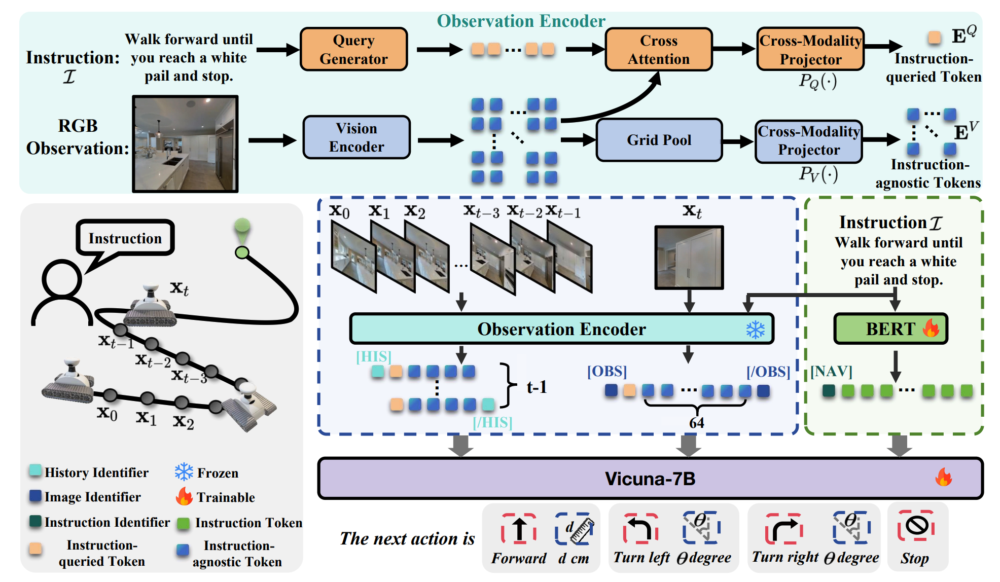

# NaVid: Video-based VLM Plans the Next Step for Vision-and-Language Navigation
2024 RSS 北大 Jiazhao Zhang, He Wang

[page](https://pku-epic.github.io/NaVid/)

任务设定：输入任务 "Walk towards the door then stop"，机器人根据任务和第一视角的 RGB 图像历史，输出 "move forward xx cm" "turn left/right xx degrees" "stop"
- 任务的语言描述里包含了对路径的 general description，机器人的核心在于执行该路径，而不是规划该路径。
- 视觉信息只有 RGB，没有 map/graph，也没有 depth。
- 输入的是一个 RGB sequence

总体思路：
使用 Frozen 的 VLM，Fine-Tuning Language Model，输出前进、转弯的动作。
- 只训练 language 部分。

## Methodology
整个 agent 是在 LLaMA-VID 的基础上改来的，其总体上可以看作是一个完成以下任务的 Language Model

```
Input: 
<HIS>{history_frames}</HIS>
<OBS>{current_frame}</OBS>
<NAV>{instruction_content}
Output:
{answer_content}
```

如果要让上面的 LLM 输出移动指令，需要解决以下问题
- 需要能够获取 vision tokens 作为 `{history_frames}` 和 `{current_frame}` 的内容，该 token 要求
    - 和 language 处于同一个空间
    - 包含 instruction 需要的 vision info
- LLM 具有输出抽象指令的能力，但是这里需要输出具体的 movement，类似 VLA。
- 需要合适的训练数据和训练目标来让 LLM 输出



### instruction-queried token
本文所使用的 instruction-queried token 和 instruction-agnostic token 和 LLaMA-VID 中的 context embedding, content embedding 基本是一致的。

BLIP-2 中提出的，将 Frozen Vision Model & Frozen LLM Model 输出的 embedding 提取到同一个 language 空间的方法。

本文使用 Q-Former，输入第 t 帧图像的 Vision Model 输出 $X_t\in \mathbb{R}^{N_x\times C}$，以及 instruction $I$，输出一个 instruction-aware query。这里的 $N_x$ 是 ViT 的 patch number (256)

$$Q_t=G_Q(X_t, I)$$

该 query 用于提取 $X_t$ 中和 instruction 相关的信息，从而得到 instruction-queried token $E_t^Q$

$$E_t^Q = P_Q(Pool(Softmax(Q_tX_t^T)X_t)) \in \mathbb{R}^{1\times C}$$

该方法和 LLaMA-ViD 中 context-embedding 的方法相同，即得到和 instruction 相关的 vision info。$P_Q$ 是单层投影网络，可以是完全 linear，也可以带一个激活层。

除了和指令相关的视觉信息外，还希望保留 general instruction-agnostic token，从而让机器人有环境的基本信息

$$E_t^V=P_V(GridPool(X_t))$$

这里和 LLaMA-VID 的 content embedding 有一点区别在于将 AvgPooling 换成了 GridPool，对每个 patch 进行 pool，从而保留一定的 geometry 信息。

### LLM Input
对于 current frame，得到 1 个 instruction-queried token, 64 个 instruction-agnostic token。对于 history frame，得到 1 个 instruction-queried token 和 4 个 instruction-agnostic token。

把上述所有的 token 按照 `<HIS>{history_frames}</HIS>
<OBS>{current_frame}</OBS>` 的方式排列。

然后把 instruction token 额外放在 `<NAV>{instruction_content}`，输入 LLM 之后让 LLM 输出 `{answer_content}`

这里的 answer 包括 `{FORWARD, TURN-LEFT, TURN-RIGHT, STOP}` 中的动作之一和对应的 distance/degree

### 训练
训练的核心设计是最大化利用有限的 Navigation 数据。

`The available navigational simulation data are still limited in their diversity, authenticity, and scale`
