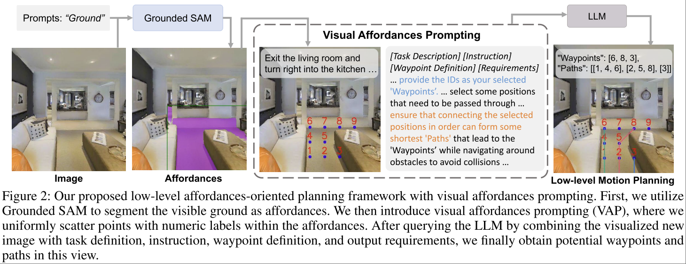

# Affordances-Oriented Planning using Foundation Models for Continuous Vision-Language Navigation

AO-Planner

Jiaqi Chen. Kwan-Yee K. Wong.

zero-shot 的做到 affordances-oriented navigation.
- zero-shot: 通过 prompting 来让 LLM 考虑 affordance。

核心是上图所示叫做 Visual Affordances Prompting (VAP) 的 prompting 策略。

