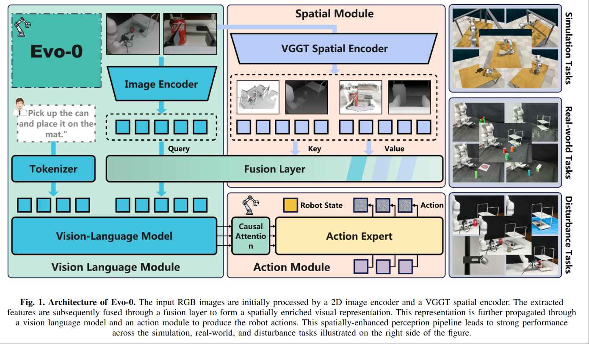

# Evo-0: Vision-Language-Action Model with Implicit Spatial  Understanding

VGGT + pi0 来做 VLA

将 VGGT 的信息通过 Cross Attention 注入到 pi0 里面

- Cross Attention 部分使用 VGGT 的 KV 和 pi0 的 Q
- pi0 并不是全量微调，而是 LoRA 微调。

## Model Architecture

本文最终目标是一个 VLA Model，即 Pi0 的部分，所以 VGGT 是提供额外信息的部分。因此这里的做法是由 VGGT Token 提供 KV，由 Paligemma 提供 Q，由单层 Cross Attention 来融合两部分信息。

具体来说：

记 Paligemma 部分的 image token 为 $t_{2D} \in \mathbb{R}^{N\times M_{2D} \times d_{2D}}$ ，VGGT 部分的 image token 为 $t_{3D} \in \mathbb{R}^{N\times M_{3D} \times d_{3D}}$

需要将这种做法和 Pi0 本身的做法区分开。

Pi0 的核心想法是 “如何将 Action Expert 独立出去的同时最大化利用 VLA 范式”，做法是 Pi0 直接使用 KV Cache 来为 Action Expert 提供语义信息。这在 Pi0 是合理的，因为 Pi0 本身就是训练包含 VLM 和 Action Expert 在内的两部分，KV Cache 本来就是同时由 Vision Language 和 Action 两部分训练到的。

但是本文，VGGT 的模态是 Pi0 本身没有见过的，不能再复用原本的 KV 值来做 KV Cache。VGGT 的 KV Cache 中的信息是 “Image Token 之间推理 Geometry Info 所需要的关联性”，这和 VLA 模型 “语言之间的关联性” 所需要的注意力是不一样的。