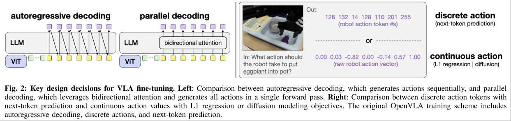
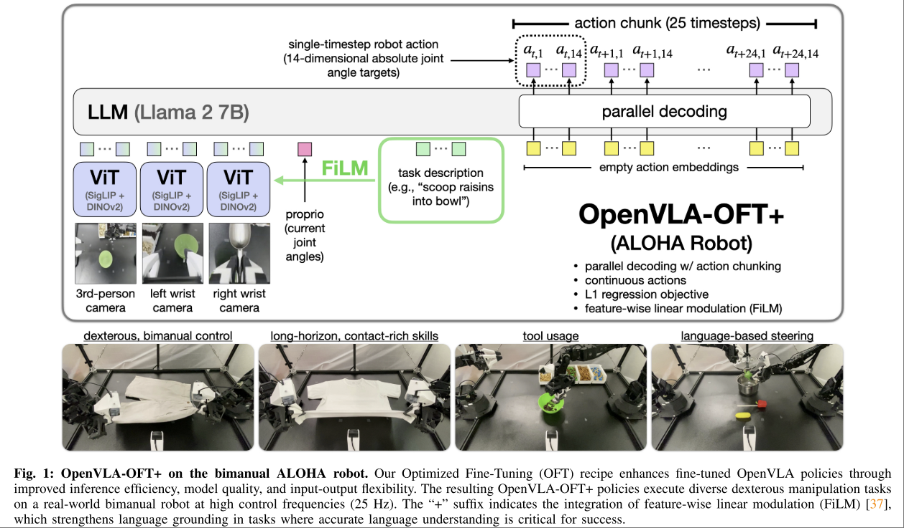
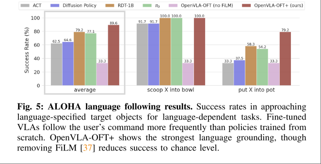

# Fine-Tuning Vision-Language-Action Models: Optimizing Speed and Success

OpenVLA OFT

文章关注的问题是如何最高效的 fine-tuning 一个 VLA。

本文非常关键的作用是在 OpenVLA 的框架下尝试了现有技巧的组合，包括

- Action Decoding Scheme
    - Autorergressive: 像个 LLM 一样，one by one 的输出
    - Parallel: 直接输出完整 Action，非要类比的话就像输出整个句子。
- Action Representation
    - Discrete: 作为词表输出
    - Continuous: 输出连续数值。
- Learning Target
    - Next-token generation: LLM SFT target
    - L1 regression: 对应连续值输出时的 target
    - Diffusion: 不光输出连续值，并且是经过 diffusion process 之后作为结果。

他们之间的差别文章里面给了个很形象的图

总体的结论是，VLA Finetuning 的最佳排列组合为

- 使用 action chunk + parallel decoding 输出动作，而不是像语言模型那样作为词序列一个一个输出
- continuous action representation 有更高的质量
- 在输出连续值的设定下，简单的 L1 和 diffusion 带来的质量是类似的，但是 L1 训练起来显著快，inference 起来也显著快。

而综合应用以上三点设定，得到的模型就是本文的 OpenVLA OFT (Optimized Fine-Tuning)。

## Language Following

除了上面提到的设计点，还有一个很重要的设计是加强了 Language 和 Vision 之间的特征关联性。

视觉信息在 VLA 的输入中所占的信息量比重是非常大的，并且很多时候纯视觉信息和动作之间是有很强关联性的。例如，看见桌子，那么手臂就要移动过去。看到鲜艳颜色，就要过去抓。模型可能会尝试拟合这些虚假的关联性，而不是语言的指令。

本文的做法是，将语言特征作为 token 处理的同时，也将其嵌入到图像特征中，让图像特征变成一个 language conditioned vision embedding。嵌入的方法是前面架构图中的 FiLM Layer。

文章甚至给了个大图

文章一个很核心的发现是，像 FiLM 这种，整体对 ViT Feature 进行 shift 的方法，能够带来显著更好的指令遵循性。

本文仅将 FiLM 应用到了多视角任务中，因为在这些场景下视觉信息更多，更容易带来虚假的关联性。

在 ALOHA 现实多视角场景下，FiLM 带来的提升极其显著。

