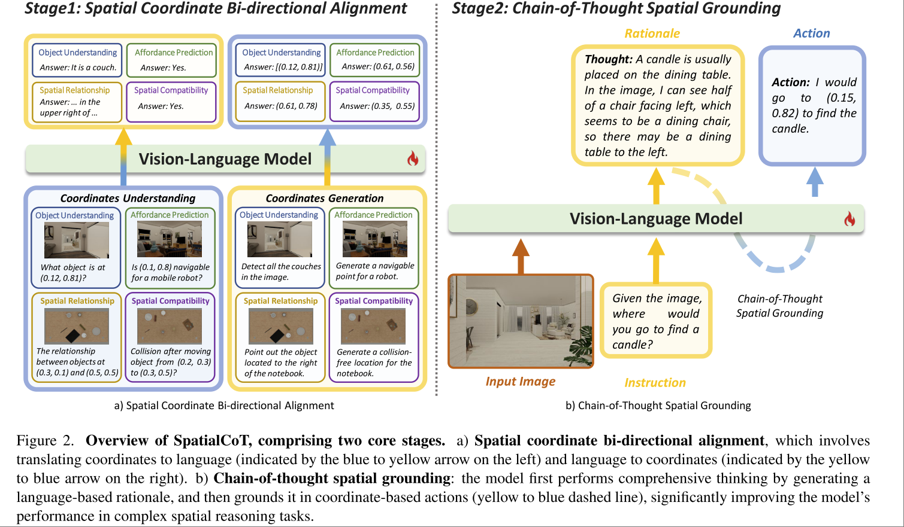

# SpatialCoT: Advancing Spatial Reasoning through Coordinate Alignment and Chain-of-Thought for Embodied Task Planning

Yuecheng Liu. Yuzheng Zhuang. Huawei Noah’s Ark Lab

https://spatialcot.github.io

提升 VLM 的 3D 空间理解能力，主要包含两阶段
- spatial coordinate bi-directional alignment: 直接用 3D 坐标相关的输入输出来 fine-tuning VLM
- chain-of-thought spatial grounding: 再次利用 VLM 的语言逻辑能力，用 CoT 来得到符合指令要求的最终输出。

通常来说 VLM 是通过大规模的 offline VQA 数据训练的，而本文则以一种 close loop 的形式，直接从仿真和现实场景中收集数据。并且将收集数据的 pipeline 完整的给出。

## Methodology

### Spatial Coordinate Bi-directional Alignment

考虑三类数据
- $X_v$: 图像
- $X_{lang}$: 不包含坐标信息的文本 ``
