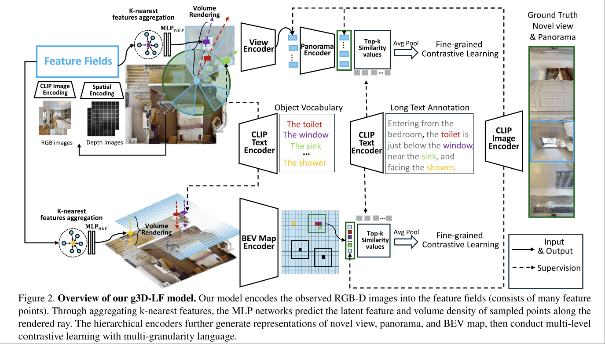

# g3D-LF: Generalizable 3D-Language Feature Fields for Embodied Tasks

Zihan Wang, Gim Hee Lee

(NUS)

https://github.com/MrZihan/g3D-LF

代码还没有完全公开。[2024 CoRL Sim-to-Real Transfer via 3D Feature Fields for Vision-and-Language Navigation](./[2024%20CoRL]%20Sim-to-Real%20Transfer%20via%203D%20Feature%20Fields%20for%20Vision-and-Language%20Navigation.md) 的后续工作。

> Generalizable 3D-Language Feature Fields (g3D-LF), a 3D representation model pre-trained on large-scale 3D-language dataset for embodied tasks

本文希望构建一个基于 BEV Map 的统一表征，并希望其具有以下特征
- 能够泛化到 unseen scenes
- 能够实时构建和更新。
- open-vocabulary

本文的基本思路是
- 使用 implicit feature field from 2D
- 通过 volume rendering 和 3D Info 建立联系。
    - 所谓的建立联系，指的是可以从这个 feature field 里面通过 volume rendering 的方式，预测 novel view, panorama view, BEV map 等 representation

核心挑战
- CLIP，DINO 等 2D Foundation Model 所得到的 feature 对 3D spatial relationships 的理解十分有限。
- Vision 和 Language 之间的 gap
- 全景和BEV视角的 map 往往需要长序列的信息才能够得到。

## Methodology

