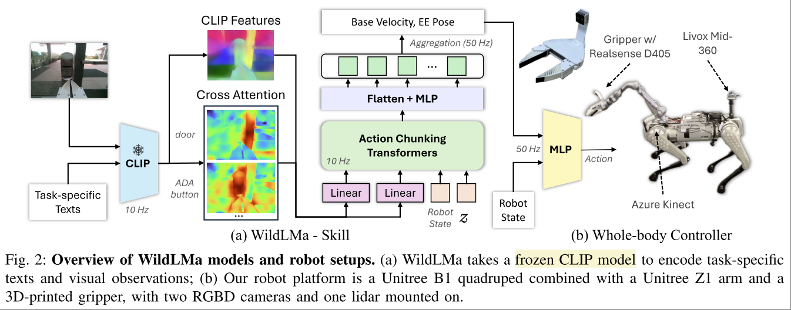
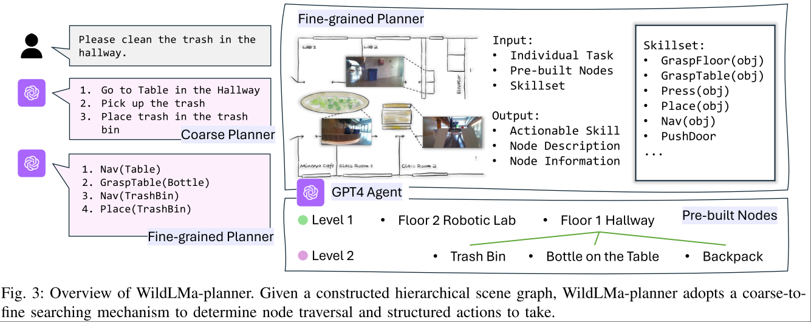

# WildLMA: Long Horizon Loco-MAnipulation in the Wild

UC San Diego. Ri-Zhao Qiu. Xiaolong Wang
https://wildlma.github.io/

Task: 'In-the-wild' robot manipulation.
- skills that generalize across object configurations （但不 across skill）
- be capable of long-horizon task execution in diverse environments
- perform complex manipulation beyond pick-and-place.

学习方案仍然是 Learn from demonstration。

总体架构就是两层，LLM 负责做 planning，并且输出特定格式。VLA 执行特定格式的 Action。每种 Action 都要单独训练一个 VLA。