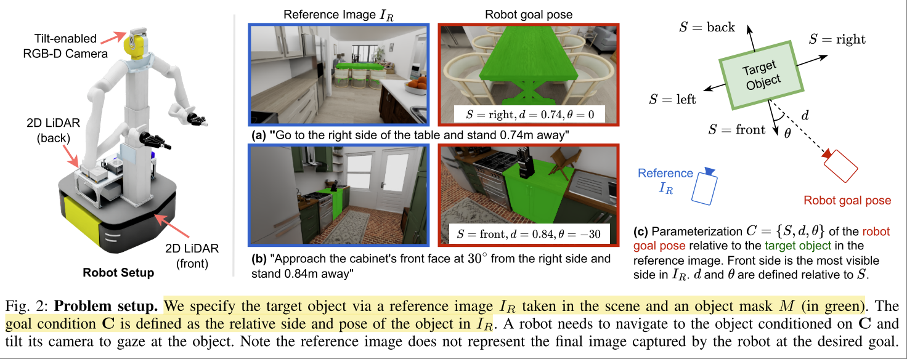
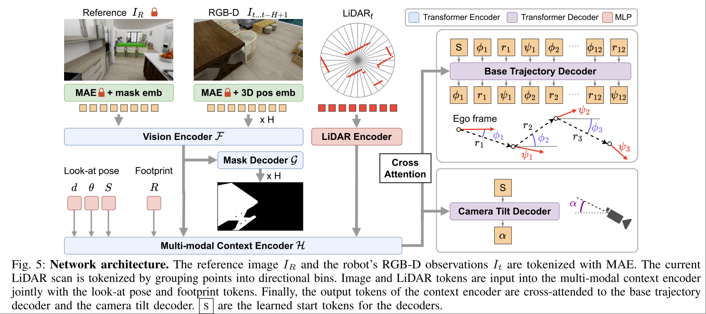

# Aim My Robot: Precision Local Navigation to Any Object

Xiangyun Meng. Fabio Ramos

https://sites.google.com/view/aimmyrobot

> Existing navigation systems mostly consider “success” when the robot reaches within 1m radius to a goal. This precision is insufficient for emerging applications where the robot needs to be positioned precisely 1 relative to an object for downstream tasks, such as docking, inspection, and manipulation.

Task: 在 VLN 的基础上往前做了一步，不仅仅是到达距离目标足够近的地方，还要求到达特定姿态。

本文的方法在仿真数据中进行了大规模训练，并且着重展示了 sim-to-real 的迁移能力。另外本文**将 HSSD 数据集中的场景导入到了 isaac sim 中**，以达到照片级的渲染，降低 sim-to-real 的难度。

**局限性：**
- 算法输入的信息要求很高，需要有 target semantic mask，以及精确的目标 pose。在已知这些信息的情况下，理论上即使直接运行 SLAM + motion planning 算法都可以完成任务。

## Problem Statement

- 机器人初始在物体附近 "vicinity"，距离小于10m，可以理解为在同一个房间内。
- goal $G=\{I_R, M, C\}$ 由以下几个部分指定
    - 一张 reference image $I_R$，以及目标物体在该图片中的 mask $M$
    - 一个与目标物体之间的 relative pose $C\{S,d,\theta\}$
        - $S\in\{front, back, left, right\}$ approach side
        - $d\in[0.0m, 1.0m]$ approach distance
        - $\theta\in \{0^\circ, \pm 15^\circ, \pm 30^\circ\}$
- 输入 RGB-D 多帧图像，LiDAR
- 输出 trajectory

## 数据生成
随机采样 $G$，然后使用 motion planning 生成 trajectory。最终的 camera pose 中是包含 pitch (tilt angle) 的，该姿态被规定为 

> The camera tilt angle is set such that the lowest vertex of the object mesh appears at ¼ above the bottom of the image (even when the object is out of view).

## Methodology

学习目标还是 learn from demonstration，只不过不光光 imitate trajectory

$$L = L_{mask} + L_{base} + L_{tilt}$$

后两项是 trajectory

第一项则是 object segmentation。