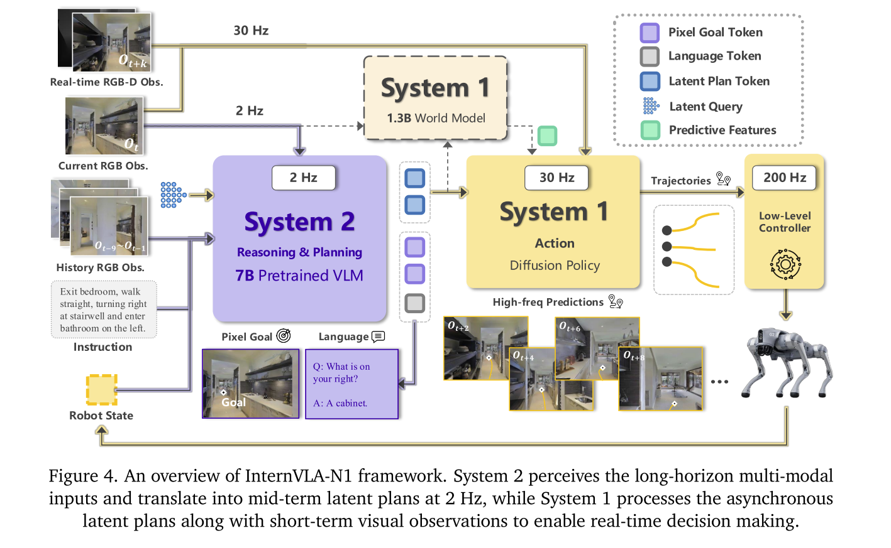
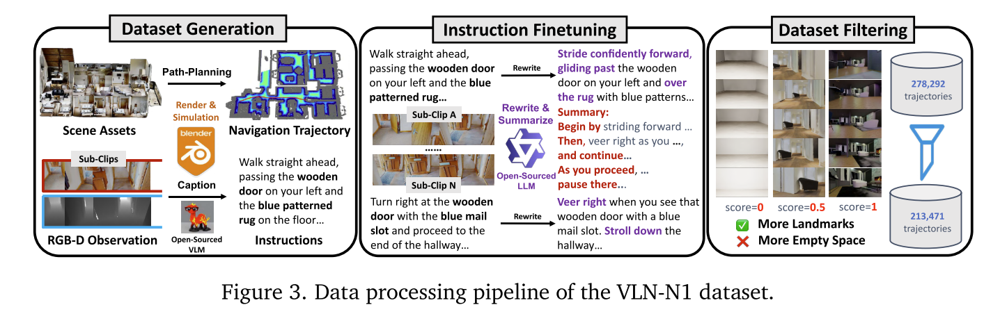

# InternVLA-N1: An Open Dual-System Vision-Language Navigation Foundation Model with Learned Latent Plans

Shanghai AI Lab.

VLN Foundation Model. 

亮点：

- 完全使用仿真生成数据训练，但是可以直接迁移到现实场景。
- 使用了双系统的设计，一个基于 MLLM-Like 的模型来生成 Navigation 的目标，一个 high frequency local planner 来做 path planning 以到达目标。本文将 high level planner 称为 System 2，而将执行器称为 System 1。

总体方案： System 2 用 MLLM 生成一个图像空间下的目标，即标记一个需要到达的像素点。然后 System 1 用 Local Planner 进行避障和执行。

这其中的核心难点为

1. 两个系统间的协同和同步。
2. 用 2D Pixel Coordinate 作为 Navigation 的目标具有模糊性，可能无法映射到准确的实际目标。
3. （文章没提）真实化渲染。

而本文的解决方案并不是提升同步率与提升 2D Coordinate 准确性，而是通过算法来执行不同步的指令、不准确的 sub-goal。而对于渲染问题，则是使用开源的真实化渲染器。

## Data Generation

本文的训练数据完全由仿真生成，使用的场景来自

- Replica
- Matterport3D
- Gibson
- 3D-Front
- HSSD
- HM3D

数据生成的流程总体为

- 使用3D资产初始化场景。
- 从场景的 Mesh Model 计算 Euclidean Signed Distance Field (ESDF). 这**应该是个 2D 的 Distance Field**
- 使用 A-Star 来随机采样 start and goal points. （应该是随机采样然后 A-Star 过滤）
- 使用 ESDF 来做 Trajectory Optimization.
- 后处理，主要是平滑。

生成 Trajectory 之后，通过 [BlenderProc](https://github.com/DLR-RM/BlenderProc) 渲染得到相片级的图像。BlenderProc 是一个 Blender 渲染 pipeline。现在好像知道HSSD宣传片是用啥做的了。

有了图像还需要生成指令。

- 提取关键帧，例如发生比较大的转弯的时候。
- 将整个 trajectory 按照关键帧切分成几个 clips。
- 用两个VLM模型来生成标签，先用 LLaVa-OneVision 生成一遍，然后用 Qwen3-72b 优化。

（尽管文章没提）生成的数据还会按照图像中的信息量进行一次过滤，由于是完全仿真生成，信息量可以直接由 semantic mask 衡量。

包括上述数据，文章一共使用了三个数据集

- VLN-N1 本文生成的数据集
- VLN-CE 包括 VLN-CE，EnvDrop，ScaleVLN 等现有 VLN 数据集。他们都是通过 Habitat simulator 从 Matterport3D 和 HM3D 场景中生成出来的。为了使数据和当前架构一致，对 action space 和 goal 都做了转换，action 比较简单，将原本的离散指令变成连续 trajectory 即可，goal 则是将目标点的 agent 位置投影到当前图像上作为 System 2 的训练数据。
- VLN-PE 用来减小 sim-to-real gap 的数据集。从 R2R Dataset 中采样 instruction and path，然后引入不同及机器人构型，包括 quadruped (Unitree AlienGo), humanoid (Unitree H1 and G1), and wheeled (Jetbot) robots。用现有的 locomotion 控制器，在仿真中控制机器人动作，渲染 RGB 图像。

## System 2

一个基于 Qwen2.5-VL 的模型，用来生成 image space 的 subgoal。Qwen2.5-VL 的架构设计中专门为了支持 2d coordinate query 而提供了 lightweight multimodal connector，一定程度上说正是这种能力使得本文倾向于采用当前技术方案。

System 2 输入一个图片序列和一个语言指令，输出当前帧中下一个目标像素。并且需要在抵达目标时停止（detect no suitable navigation waypoint）.

考虑到 Qwen2.5-VL 作为基础，以及训练方式依然限于微调，这里输出像素坐标的方式依然是语言。

System 2 中的大模型使用 VLN-CE 部分的数据集微调。

## System 1

System 1 model is a diffusion-based local navigation policy designed for real-time collision avoidance and path planning.

看上去这个 System 1 反而才是大量生成数据训练的对象。

### Goal Alignment

System 2 输出的像素坐标对于 Navigation 来说本身是一个过于模糊的指令，而本文执行这个指令的方法是先训 Two auxiliary prediction heads （一个根据目标图像预测目标位置，一个），将原本的 image pixel goal 映射到 (3D) point goal，直接用 VLN-N1 仿真数据中的 point goal 作为学习目标训练。

point goal 即实际要到达的坐标，由于本文本质上是一个 2D Navigation 任务，point goal 被表示成目标位置相对于当前帧的 2D 坐标和 yaw。$p_g=(x,y,\theta)$

这其实有点 tricky， **既然有训练数据，那直接训练输出 point goal 的 system 2 不就行了？** 我的理解是，直接输出 point goal 对于大模型微调来说困难得多，但是 Qwen2.5 VL 刚好专门为 2D Pixel Query 做过强化，是一个现成的可以输入输出像素坐标的 VLM，所以才有了当前这样一个方案。

System 1 一个比较特殊的设计是，本文同时训练模型分别从两种信息中推断 point-goal，一个是 pixel-goal $c_g=(u,v)$ 的 encoding，这与 inference 时候 System 2 的输出一致。另一个则是目标帧的 image $I_g\in \mathbb{R}^{C\times H\times W}$ 的 encoding，本文认为额外增加基于图像的预测任务有助于 System 1 学会应当关心的图像信息。

这就使得 System 1 的训练目标实际上分成两部分

- $\lVert \text{MLP}(z_{img}) - p_g  \rVert^2$
- $\lVert \text{MLP}(z_{pix}) - p_g \rVert^2$

另外，$z_{pix}$ 并不是直接输入 2D 坐标，而是将 2D 坐标周围的像素取 1，其余取 0 得到一个 mask 图像作为输入。

完整的 Goal Alignment Loss 为

$$\mathcal{L}^{goal} = \frac{1}{N}\sum_{i=1}^N \lVert \text{MLP}(z_{img}) - p_g  \rVert^2 + \frac{1}{N}\sum_{i=1}^N \lVert \text{MLP}(z_{pix}) - p_g \rVert^2$$

公式中带有 N 的原因是为了把上面的 loss 一起写到下面的 Overall Training Objectove 中。

### Overall training objective

System 1 的完整模型基于该团队先前工作 [NavDP](https://github.com/InternRobotics/NavDP)，简单说是一个同时生成 continuous trajectory 和 safe score 的 Diffusion Model。完整的学习目标也就同时包含了 waypoint 生成、safe score 预测、goal alignment。

$$\mathcal{L}^{system1}=\alpha \cdot \mathcal{L}^{act} + \beta \cdot \mathcal{L}^{critic} + \gamma \cdot \mathcal{L}^{goal}$$

## 问题

1. 对于看不见的 subgoal 怎么办？？

答案是不处理，数据生成的时候就不生成视野外的，而只生成视野内的下一个位置。
