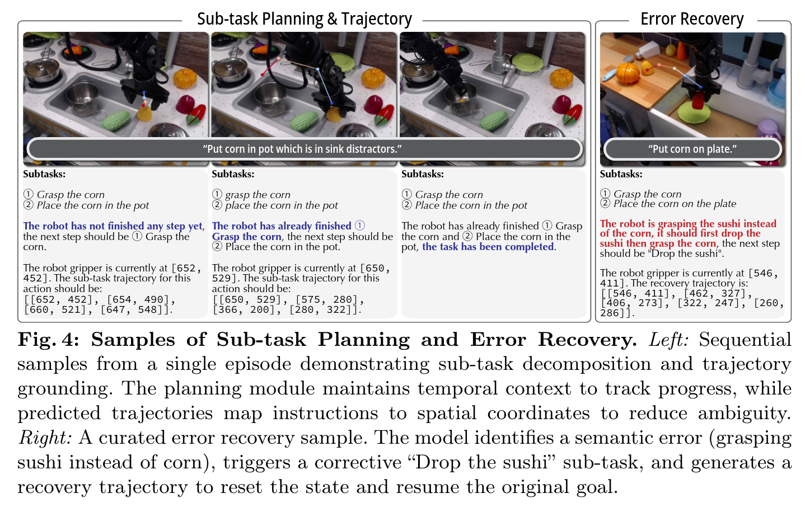

# Long-Horizon Manipulation via Trace-Conditioned VLA Planning

- [page](https://www.liuisabella.com/LoHoManip/)

Task: long-horizon manipulation. 可以包括多个子任务。

Core Idea: 用画 Trace 的方式来打破 VLA 的 short horizon 限制。VLA 不再是只 conditioned on vision language，而是直接 conditioned on trace。

- 输入图片与 High level instruction
- VLM 进行子任务分解，并且绘制下一个 sub task 的 trace。
    - VLM 需要一并判断已经完成了多少 sub task
    - VLM 有自己的 context memory 来记录任务完成情况
- 将绘制了 trace 的图像，sub task 的 instruction 交给一个完整的 VLA 模型进行操作。
    - VLA 在绘制了 trace 的图像上进行了微调。

本身只是对 VLM + VLA 的一个粗暴地组合。

## Progress-aware plan representation

为了让 VLM 能够进行多步的 subtask planning，在 VLM 的输入中加入 History 信息，让 VLM 自己判断执行到了哪里，是否要修正，是否要画新的 trace。

从现有 VLM 能力的角度来看，并不是一个非常可靠的东西，并不是一个很合理的解决方案。

## 2D Trace

在图像空间上。考虑到使用的 Qwen3VL 作为基础进行微调，应该也是 0-1000 normalized 2d coordinate.

## Train

模型的两部分分别训练

- Task manager: 一个完整的 VLM，用 VLM 的方式训练，数据中包含了 subtask 和 2d trace
- Executor: 一个完整的 VLA (包含独立的 VLM Backbone)，同样用 VLA 的方法训练，数据中的输入图像上包含 2D Trace 的可视化。

数据来源有两个

- OXE
- RoboVQA and EgoPlan-BenchIT 中提供的数据，主要用于丰富 VLM 部分的训练数据

## Evaluation

本文在多个 Benchmark 上进行测评，Benchmark 的选择很有参考价值

- RoboVQA
- EgoPlan-Bench2
- ShareRobot-T
- VABench-V

上述所有 Benchmark 都只测评 VLM 部分的能力，包括任务的拆解和 2D Trace 的输出。

- LIBERO
- VLABench

测评 VLA 部分的能力。