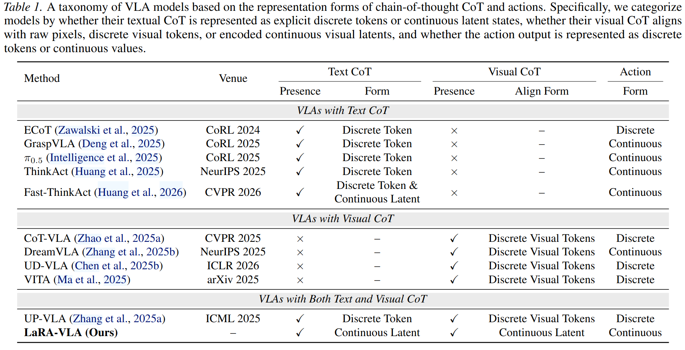
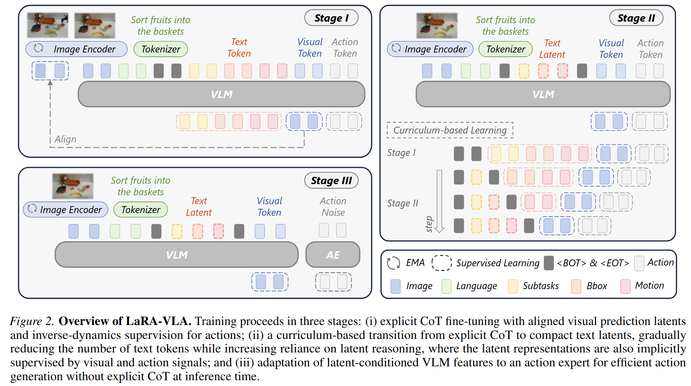

# Latent Reasoning VLA: Latent Thinking and Prediction for Vision-Language-Action Models

LaRA-VLA Paper，方案基于 Fast-ThinkAct, 在 Fast-ThinkAct 的基础上把 visual CoT 也在 latent space 进行。

Shuanghao Bai, Jing Lyu, et al. 西安交通大学 & BAAI & 北大. Arxiv 2026.05.

Task: 将 VLA 中的 Chain-of-Thought 推理从显式离散 token 内化为连续 latent 表示，消除推理时的 CoT 生成开销，同时保持甚至超越显式 CoT 的性能。

现有 CoT-based VLA 的两个核心问题：
1. **推理延迟高**：文本 CoT 需要长序列自回归生成，控制频率低至 ~1Hz，无法满足实时控制需求
    - 本文做法是不使用 auto-regressive 的方式进行思考，而是直接使用 special token 作为 placeholder 一起输入模型，然后提取该位置的 latent feature 作为 latent reasoning
2. **表征不匹配**：文本 CoT 和 Visual CoT 都依赖离散 token（language token / VQ token），但机器人的感知和控制本质上是连续空间
    - 本文的做法是不限制输出词表中的离散词，而是直接取 special token 处的 latent，不直接监督 special token 解码出来的内容。这依然延续了很多 Foundation Model 设计中的 Register Token 思路，例如 BERT 中的 CLS token, DINO-reg 中的 register token，VGGT 中的 register token

核心论点：CoT 之所以有效，不是因为它用自然语言表达，而是因为它暴露了结构化的中间推理过程。在 embodied 场景中，推理应该用连续 latent 来承载。

值得一提的是在 Related Work 部分，本文对现有的 CoT-VLA 方法做了一个总结，其中的相关论文可以考虑后续看一下。

## Method

以 Qwen3-VL 为 backbone VLM，训练过程则是一个从 explicit 到 latent，从 auto-regressive 到 feed-forward 的逐步训练的过程。

本文引入了两种 special token

- **Textual CoT** → Latent text tokens (用 `<thinking>` token 替代)
    - 输出端并不会直接被监督。
- **Visual CoT** → Latent visual goal (预测下一帧的视觉 latent，用 `<img_next>` token)
    - 输出端直接用 VLM Vision Space 中的 Next Image Embedding 进行监督 $\mathcal{L}_{vis} = \|\hat{z}_{t+1} - z_{t+1}\|_1$

这两个 token 在输入侧都是 learnable token embedding，在输出侧则各有不同。

### Stage I: Explicit CoT Fine-Tuning

输入序列包含完整的显式 CoT annotation（subtask 分解 + bbox + motion reasoning）+ `<img_next>` token + action token。

损失函数：$\mathcal{L}_{cot} + 0.1\mathcal{L}_{vis} + \mathcal{L}_{act-dis}$

- $\mathcal{L}_{cot}$: 标准 next-token prediction 监督 CoT 生成
- $\mathcal{L}_{vis} = \|\hat{z}_{t+1} - z_{t+1}\|_1$: 对齐预测的未来视觉 latent 与 EMA encoder 编码的 target
- $\mathcal{L}_{act-dis}$: 离散 action token 自回归预测（基于 FAST tokenizer）

EMA 用于稳定 visual latent target，防止 representation collapse。

### Stage II: Curriculum-based Replacement

渐进式将离散 CoT token 替换为 learnable `<thinking>` latent token：

- 1 个 thinking token 替代 subtask 描述。经过替换之后，仍然可以训练模型的 thinking 能力的原因在于
    - 此时仍然有其他剩余任务，例如 bbox, motion reasoning attend to `<thinking>`，以及 `<img_next>` 也 attend to thinking token。
    - 前面 step 1 的训练已经让模型学会了基于思考来推理后续任务。
- 2 个 thinking token 进一步替代 bbox
- 3 个 thinking token 完全替代所有文本 CoT

最终损失：$0.2\mathcal{L}_{vis} + \mathcal{L}_{act-dis}$（CoT loss 逐步退火到 0）

Visual goal latent 在此阶段作为 implicit supervision 引导 textual latent 的学习。

### Stage III: Action Generation via Flow Matching

去除离散 action token prediction，启用 Diffusion Transformer action expert：

$$\mathcal{L}_{act-con} = \mathbb{E}_{a_t, \epsilon, \tau} \left[ \|v_{\theta_a}(a_\tau, \tau | h_t) - (a_t - \epsilon)\|^2_2 \right]$$

其中 $h_t$ 聚合了当前视觉观测、language instruction、text latent reasoning、predicted visual goal latent。

### Attention Mechanism

- Current image tokens 之间双向 attention
- Future image tokens 因果地 attend to text 和 current image，内部双向
- Stage I&II: action tokens 自回归地 attend to 所有前序 token
- Stage III: action tokens 从 attention 中移除，由独立 action expert 处理

### Data Pipeline

Anchor-first, generate-later 范式：
- **Semantic anchors**: Qwen3-VL 从首帧 + 指令中提取操作目标物体
- **Temporal anchors**: 根据 gripper 状态变化分割轨迹为原子操作阶段
- **Subtask**: Qwen3-VL 为每个 segment 生成描述
- **Bbox**: GroundingDINO + SAM3 进行 open-vocabulary 目标定位
- **Motion reasoning**: 从末端执行器轨迹计算全局/局部运动方向描述符

构建了 LIBERO-LaRA 和 Bridge-LaRA 两个数据集。

## Experiments

### LIBERO Benchmark

| CoT Type | Method | Avg. |
|----------|--------|------|
| No CoT | OpenVLA-OFT | 97.1 |
| Textual CoT | DeepThinkVLA | 97.0 |
| Visual CoT | F1 | 95.7 |
| **Latent CoT** | **LaRA-VLA** | **97.9** |

在 Object suite 达到 99.8%，Long suite 达到 96.6%。

### SimplerEnv-WidowX

LaRA-VLA 达到 68.8% 平均成功率，超越所有 baseline。

### Real-World (Long-horizon)

4 类长时序任务（100 demo/task, 30Hz），对比 ACT / ECoT / GR00T N1.5。LaRA-VLA 总体最优，尤其在需要跨子任务协调的任务上优势明显。

### Inference Efficiency

| Method | Latency |
|--------|---------|
| ThinkAct-7B | 7513 ms |
| ECoT-7B | 4434 ms |
| Fast-ThinkAct-3B | 805 ms |
| **LaRA-VLA-4B** | **135 ms** |

相比显式 CoT 方法推理延迟降低高达 90%。

### Ablation

- Latent text CoT (64.6%) >> Explicit text CoT (58.3%) >> No CoT (55.2%)
- Latent text + Latent visual CoT 组合效果最佳 (68.8%)
- Visual CoT latent 既注入未来状态预测信息，又隐式正则化 text latent
- Action pretraining (Stage I&II 的离散 action 监督) 帮助组织 latent space 使其与 action space 对齐
- EMA 提升 latent diversity (effective rank 6.76 vs 5.10) 和语义分离度

## Key Insights

1. **Latent reasoning > Explicit CoT for embodied control**: 连续 latent 比离散 token 更适合连续感知/动作空间
2. **Visual goal latent 作为 implicit supervisor**: 预测未来视觉状态为 text latent 提供 grounding signal
3. **Curriculum 是关键**: 直接训练 latent reasoning 效果差，需要从显式 CoT 逐步过渡
4. **Single token per reasoning step**: 当前实现每步只用一个 latent token，限制了表达力但避免 collapse

## Limitations

- Latent token 数量增多时容易 collapse（目前限制为每步 1 个 token）
- Curriculum 训练中 CoT 相关 token 数量递增，训练成本较高
