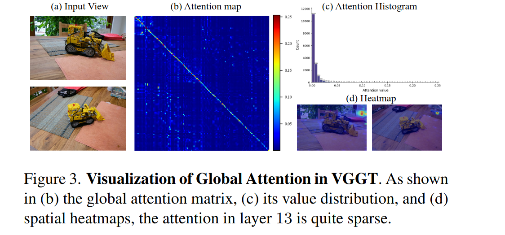

# VGGT-Ω

CVPR 2026 Oral. [VGGT](./[2025%20CVPR]%20VGGT%20Visual%20Geometry%20Grounded%20Transformer.md) 作者自己做的续作。

核心修改：

- 对 register token 的使用方式做了比较大的改动，在部分 global attention layer，限制 attention 只在 "scene register" 之间进行，从而鼓励模型将 scene level info 放在这些 token 中。
- 将 DPT Head 替换为了更简单的 MLP Based 架构。
- 减少了训练的 task 数量，训练期间只保留了一个 dense depth head，和一个 sparse camera head。point map 和 track head 都直接移除了。
- 对长程 sequence 以及动态场景的支持大大提升
- 数据规模提升，通过自动化的管线，标注了 4M high quality sequences。
- 额外通过 self-supervised learning 的方式，将 18M 无标注视频纳入训练。
- 模型参数量提升，提供了最大 10B 的模型，验证了模型架构可以支持 scale up。

## Architecture

ViT Backbone 换成了 DINOv3。

Register token 数量改成了每帧 1 个 camera token 16 个 scene token。同样区分第一帧和其他帧两个 parameter set。

文中提到了 [Fast VGGT](./[2025%20Arxiv]%20FastVGGT%20Training-Free%20Acceleration%20of%20Visual%20Geometry%20Transformer.md) 和 Faster VGGT，指出这些研究验证了 token 利用率可以大幅度提升。

本文中 25% 的 global attention 被直接替换成了 register attention，即直接在 16 个 register token 之间做 attention。

对于 DPT Head，将低分辨率部分保留 DPT 结构，但是最大的 resolution 处理换成了 MLP + Pixel Shuffle。Pixel Shuffle 指的是将 MLP 输出的 channel 平分四份展开到4个 pixel。文章页尝试了 pure MLP 来输出 dense prediction，但是会产生伪影问题。

Point Map 和 Track Head 被直接移除，但是在 loss 计算时仍然会计算这两项。

Point Loss 直接使用预测的 depth 和 camera 来投影 point map，然后计算 loss。

Matching Loss (原本的 Track head loss) 则直接换成了更直接的 Contrastive like 的 loss

$$
\mathcal{L}_{\text{match}} = \mathbb{E}_{\text{pos}}[-\log{\sigma(s)}] + \mathbb{E}_{\text{neg}}[-\log(1-\sigma(s))]
$$

s 是 token pair 之间的 cosine similarity。positive token pair 和 negative token pair 直接由投影来决定，即投影之后重合度大于 10% 的两个 patch 的 token 被认为是 positive token pair。